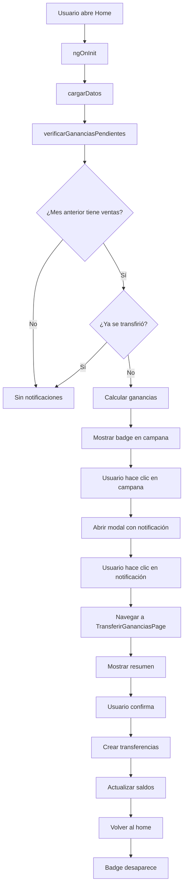

# Sistema de Ganancias Mensuales

## 📋 Índice

1. [Introducción](#1-introducción)
2. [Conceptos del Negocio](#2-conceptos-del-negocio)
3. [Arquitectura del Sistema](#3-arquitectura-del-sistema)
4. [Flujo Completo](#4-flujo-completo)
5. [Implementación Técnica](#5-implementación-técnica)
6. [Cálculos y Fórmulas](#6-cálculos-y-fórmulas)
7. [Testing](#7-testing)
8. [Performance](#8-performance)

---

## 1. Introducción

Sistema automático de notificaciones y transferencia de ganancias mensuales de recargas (Celular y Bus) hacia Caja Chica.

### Características Principales

- ✅ **Detección automática** de ganancias pendientes del mes anterior
- ✅ **Notificación proactiva** con badge en campana del header
- ✅ **Cálculo automático** de comisiones (5% Celular, 1% Bus)
- ✅ **Transferencia transaccional** con trazabilidad completa
- ✅ **Validación anti-duplicados** para evitar transferencias repetidas

---

## 2. Conceptos del Negocio

### 2.1. Comisiones por Servicio

| Servicio | Comisión | Frecuencia | Destino |
|----------|----------|------------|---------|
| Recargas Celular | 5% | Mensual | CAJA_CHICA |
| Recargas Bus | 1% | Mensual | CAJA_CHICA |

### 2.2. Proceso Mensual

```
┌─────────────────────────────────────────────────────────────┐
│                     CICLO MENSUAL                           │
├─────────────────────────────────────────────────────────────┤
│                                                             │
│  Enero 1-31:  Ventas de recargas (operaciones INGRESO)    │
│               ├─ CAJA_CELULAR recibe efectivo             │
│               └─ CAJA_BUS recibe efectivo                 │
│                                                             │
│  Feb 1-7:     Sistema detecta ganancias pendientes        │
│               ├─ Calcula: Enero Celular = $1,500 × 5%     │
│               ├─ Calcula: Enero Bus = $2,000 × 1%         │
│               └─ Muestra notificación: $95 pendiente      │
│                                                             │
│  Usuario:     Confirma transferencia manual               │
│               ├─ Mueve físicamente el efectivo            │
│               └─ Sistema registra operaciones             │
│                                                             │
│  Resultado:   Ganancias en CAJA_CHICA                     │
│               ├─ $75 desde CAJA_CELULAR                   │
│               └─ $20 desde CAJA_BUS                       │
│                                                             │
└─────────────────────────────────────────────────────────────┘
```

---

## 3. Arquitectura del Sistema

### 3.1. Componentes

```
┌─────────────────────────────────────────────────────────────┐
│                    COMPONENTES                              │
├─────────────────────────────────────────────────────────────┤
│                                                             │
│  📱 HomePage                                                │
│  ├─ Verifica ganancias pendientes (ngOnInit)              │
│  ├─ Muestra badge en campana                              │
│  └─ Abre modal de notificaciones                          │
│                                                             │
│  🔔 NotificacionesModalComponent                           │
│  ├─ Lista notificaciones dinámicas                        │
│  └─ Navega a TransferirGananciasPage                      │
│                                                             │
│  💰 TransferirGananciasPage                                │
│  ├─ Muestra resumen de ganancias                          │
│  ├─ Valida acción del usuario                             │
│  └─ Ejecuta transferencias                                │
│                                                             │
│  🔧 GananciasService                                        │
│  ├─ verificarGananciasPendientes()                        │
│  ├─ calcularVentasMes()                                   │
│  └─ yaSeTransfirio()                                      │
│                                                             │
│  🏦 CajasService                                            │
│  └─ crearTransferencia()                                  │
│                                                             │
└─────────────────────────────────────────────────────────────┘
```

### 3.2. Servicios

#### **GananciasService**
```typescript
export class GananciasService {
  // Verifica si hay ganancias del mes anterior sin transferir
  async verificarGananciasPendientes(): Promise<GananciasPendientes | null>

  // Calcula ventas totales de una caja en un mes
  private async calcularVentasMes(cajaId: number, mes: string): Promise<number>

  // Verifica si ya existe transferencia para un mes
  private async yaSeTransfirio(mes: string): Promise<boolean>
}
```

#### **CajasService**
```typescript
export class CajasService {
  // Crea transferencia entre cajas con trazabilidad
  async crearTransferencia(params: {
    cajaOrigenId: number;
    cajaDestinoId: number;
    monto: number;
    empleadoId: number;
    descripcion: string;
  }): Promise<void>
}
```

---

## 4. Flujo Completo

### 4.1. Diagrama de Flujo



### 4.2. Paso a Paso Detallado

#### **1. Detección Automática (Home)**

```typescript
async cargarDatos() {
  // Ejecutar en paralelo con otras consultas
  const [cajaAbierta, saldos, gananciasPendientes, ...] = await Promise.all([
    this.cajasService.verificarEstadoCaja(),
    this.cajasService.obtenerSaldosCajas(),
    this.gananciasService.verificarGananciasPendientes(), // ← Aquí
    // ...
  ]);

  // Actualizar UI
  this.gananciasPendientes = gananciasPendientes;
  this.notificacionesPendientes = gananciasPendientes ? 1 : 0;
}
```

#### **2. Verificación de Ganancias (GananciasService)**

```typescript
async verificarGananciasPendientes(): Promise<GananciasPendientes | null> {
  const mesAnterior = this.getMesAnterior(); // '2026-01'

  // 1. Verificar si ya se transfirió
  const yaTransferido = await this.yaSeTransfirio(mesAnterior);
  if (yaTransferido) return null;

  // 2. Calcular ventas del mes
  const [ventasCelular, ventasBus] = await Promise.all([
    this.calcularVentasMes(3, mesAnterior), // CAJA_CELULAR
    this.calcularVentasMes(4, mesAnterior)  // CAJA_BUS
  ]);

  // 3. Calcular ganancias
  return {
    mes: mesAnterior,
    mesDisplay: 'Enero 2026',
    ventasCelular,
    ventasBus,
    gananciaCelular: ventasCelular * 0.05,
    gananciaBus: ventasBus * 0.01,
    total: (ventasCelular * 0.05) + (ventasBus * 0.01)
  };
}
```

#### **3. Notificación (Modal)**

```typescript
ngOnInit() {
  if (this.gananciasPendientes) {
    this.notificaciones.push({
      titulo: 'Transferir ganancias',
      mensaje: this.gananciasPendientes.mesDisplay,
      detalle: `Celular: $${...} | Bus: $${...} | Total: $${...}`,
      icono: 'cash-outline',
      color: 'success'
    });
  }
}
```

#### **4. Transferencia (TransferirGananciasPage)**

```typescript
private async ejecutarTransferencia() {
  const empleado = await this.authService.getEmpleadoActual();

  // Crear 2 transferencias en paralelo
  await Promise.all([
    // CAJA_CELULAR → CAJA_CHICA
    this.cajasService.crearTransferencia({
      cajaOrigenId: 3,
      cajaDestinoId: 2,
      monto: this.ganancias.gananciaCelular,
      empleadoId: empleado.id,
      descripcion: `Ganancia 5% ${this.ganancias.mes}`
    }),

    // CAJA_BUS → CAJA_CHICA
    this.cajasService.crearTransferencia({
      cajaOrigenId: 4,
      cajaDestinoId: 2,
      monto: this.ganancias.gananciaBus,
      empleadoId: empleado.id,
      descripcion: `Ganancia 1% ${this.ganancias.mes}`
    })
  ]);

  // Navegar al home con refresh
  await this.router.navigate(['/home'], {
    queryParams: { refresh: Date.now() }
  });
}
```

---

## 5. Implementación Técnica

### 5.1. Queries SQL

#### **Calcular ventas de un mes**
```sql
SELECT SUM(monto) AS total_ventas
FROM operaciones_cajas
WHERE caja_id = 3  -- CAJA_CELULAR
  AND tipo_operacion = 'INGRESO'
  AND fecha >= '2026-01-01'
  AND fecha < '2026-02-01';
```

#### **Verificar si ya se transfirió**
```sql
SELECT id
FROM operaciones_cajas
WHERE tipo_operacion = 'TRANSFERENCIA_SALIENTE'
  AND (descripcion ILIKE '%Ganancia 5% 2026-01%'
       OR descripcion ILIKE '%Ganancia 1% 2026-01%')
LIMIT 1;
```

#### **Crear transferencia**
```sql
-- 1. CAJA_CELULAR: TRANSFERENCIA_SALIENTE
INSERT INTO operaciones_cajas (
  caja_id, empleado_id, tipo_operacion, monto,
  saldo_anterior, saldo_actual, descripcion
) VALUES (
  3, 1, 'TRANSFERENCIA_SALIENTE', 75.00,
  500.00, 425.00, 'Ganancia 5% 2026-01'
);

-- 2. CAJA_CHICA: TRANSFERENCIA_ENTRANTE
INSERT INTO operaciones_cajas (
  caja_id, empleado_id, tipo_operacion, monto,
  saldo_anterior, saldo_actual, descripcion
) VALUES (
  2, 1, 'TRANSFERENCIA_ENTRANTE', 75.00,
  100.00, 175.00, 'Ganancia 5% 2026-01 desde Caja Celular'
);

-- 3. Actualizar saldos en tabla cajas
UPDATE cajas SET saldo_actual = 425.00 WHERE id = 3;
UPDATE cajas SET saldo_actual = 175.00 WHERE id = 2;
```

### 5.2. Validación Anti-Duplicados

El sistema previene transferencias duplicadas mediante:

1. **Verificación en `yaSeTransfirio()`**: Busca operaciones existentes por descripción
2. **Descripción única**: Incluye mes específico (`Ganancia 5% 2026-01`)
3. **Query con LIMIT 1**: Optimizada para detectar rápidamente

---

## 6. Cálculos y Fórmulas

### 6.1. Cálculo de Ganancias

```typescript
// Comisión Celular: 5%
gananciaCelular = ventasCelular × 0.05

// Comisión Bus: 1%
gananciaBus = ventasBus × 0.01

// Total a transferir
totalGanancias = gananciaCelular + gananciaBus
```

### 6.2. Ejemplo Práctico

**Ventas de Enero 2026:**
- Celular: $1,500.00
- Bus: $2,000.00

**Cálculo:**
```
Ganancia Celular = $1,500.00 × 5% = $75.00
Ganancia Bus     = $2,000.00 × 1% = $20.00
─────────────────────────────────────────
Total a transferir = $95.00
```

**Operaciones creadas:**
1. CAJA_CELULAR → CAJA_CHICA: $75.00
2. CAJA_BUS → CAJA_CHICA: $20.00

---

## 7. Testing

### 7.1. Script de Prueba

Ver: [`doc/test_notificaciones_ganancias.sql`](../../../../doc/test_notificaciones_ganancias.sql)

Este script crea:
- 10 operaciones de INGRESO en CAJA_CELULAR (enero)
- 15 operaciones de INGRESO en CAJA_BUS (enero)
- Total: ~$1,500 Celular + ~$2,000 Bus
- Ganancias esperadas: ~$95

### 7.2. Guía de Testing

Ver: [`doc/TESTING_NOTIFICACIONES.md`](../../../../doc/TESTING_NOTIFICACIONES.md)

Incluye:
- Instrucciones paso a paso
- Checklist de pruebas
- Troubleshooting
- Queries de verificación

---

## 8. Performance

### 8.1. Análisis de Consumo

**Queries por verificación:**
- Verificar si transferido: ~10ms
- Sumar ventas Celular: ~50ms
- Sumar ventas Bus: ~50ms
- **Total: ~100ms**

**Frecuencia:**
- 1 vez por carga del home
- Ionic cachea tabs → Máximo 5-10 veces/día

**Consumo mensual:**
- Queries: ~300/mes
- Ancho de banda: ~0.15 MB/mes
- Comparado con límite: 5,000 MB/mes
- **Impacto: 0.003% (insignificante)**

### 8.2. Optimizaciones Implementadas

1. **Queries en paralelo**: `Promise.all()` para ventas de ambas cajas
2. **Query optimizada**: `LIMIT 1` en verificación de transferencias
3. **Índices en BD**: `fecha`, `tipo_operacion`, `caja_id`
4. **Cache de tabs**: Ionic previene cargas innecesarias

---

## 9. Archivos Relacionados

### **Servicios:**
- [`ganancias.service.ts`](../services/ganancias.service.ts) - Lógica de cálculo y verificación
- [`cajas.service.ts`](../services/cajas.service.ts) - Método `crearTransferencia()`

### **Páginas:**
- [`home.page.ts`](../pages/home/home.page.ts) - Verificación automática
- [`transferir-ganancias.page.ts`](../pages/transferir-ganancias/transferir-ganancias.page.ts) - Confirmación y ejecución

### **Documentación:**
- [`DASHBOARD-README.md`](./DASHBOARD-README.md) - Documentación general del módulo
- [`test_notificaciones_ganancias.sql`](../../../../doc/test_notificaciones_ganancias.sql) - Script de prueba
- [`TESTING_NOTIFICACIONES.md`](../../../../doc/TESTING_NOTIFICACIONES.md) - Guía de testing

---

## 10. Decisiones de Diseño

### ¿Por qué automático en lugar de manual?

**Evaluamos 3 opciones:**

1. ✅ **Automático (implementado)**: Verifica en cada carga del home
   - Proactivo, imposible olvidar
   - Overhead insignificante (~100ms, ~0.15 MB/mes)

2. ❌ **Manual con enlace en sidebar**: Usuario debe activar
   - Cero overhead
   - Riesgo de olvido

3. ❌ **Trigger PostgreSQL**: Automático en BD
   - Complejo de implementar
   - No elimina queries del cliente

**Conclusión:** El enfoque automático ofrece la mejor UX con overhead insignificante.

---

**Fecha de Creación:** 2026-02-03
**Versión:** 1.0
**Autor:** Sistema Mi Tienda
