# Sistema de Control de Recargas y Cierre Diario (VERSIÓN 4.1)

**IMPORTANTE:** Este documento refleja la Versión 4.1 del sistema donde:
- ✅ **NUEVO v4.1:** Múltiples cierres por día (1 cierre por turno)
- ✅ **NUEVO v4.1:** Relación turno ↔ cierre (1:1)
- ✅ **NUEVO v4.1:** Recargas por turno (no por día)
- ✅ Ultra-simplificado: Solo 1 campo de entrada (efectivo_recaudado)
- ✅ Configuración centralizada: fondo_fijo desde configuraciones
- ✅ Fórmula simplificada: depósito = efectivo - fondo - transferencia
- ✅ `caja_fisica_diaria` representa la **CAJA FÍSICA por turno**
- ✅ `CAJA` (tabla cajas) es la **caja de ACUMULACIÓN**

## Índice

1. [Introducción](#1-introducción)
2. [Cambios Versión 4.1](#2-cambios-versión-41)
3. [Arquitectura del Sistema](#3-arquitectura-del-sistema)
4. [Conceptos Clave](#4-conceptos-clave)
5. [Flujo Completo del Cierre por Turno](#5-flujo-completo-del-cierre-por-turno)
6. [Sistema de Trazabilidad](#6-sistema-de-trazabilidad)
7. [Validaciones del Sistema](#7-validaciones-del-sistema)
8. [Ejemplo Práctico Completo](#8-ejemplo-práctico-completo)
9. [Queries de Auditoría](#9-queries-de-auditoría)
10. [Función PostgreSQL Completa](#10-función-postgresql-completa)
11. [Troubleshooting](#11-troubleshooting)

---

## 1. Introducción

Este documento describe el **Sistema de Control de Recargas y Cierre por Turno v4.1** para Mi Tienda, un sistema ultra-simplificado de gestión de efectivo y saldos virtuales que maneja:

- ✅ **Múltiples turnos por día** (cada empleado puede abrir/cerrar su turno)
- ✅ **1 cierre contable por turno** (relación 1:1 turno ↔ cierre)
- ✅ Control de saldos virtuales (Bus y Celular)
- ✅ Gestión de 4 cajas de efectivo
- ✅ Cierre transaccional con rollback automático
- ✅ Trazabilidad 100% de operaciones
- ✅ Auditoría completa por turno

### Características Principales v4.1

| Característica | Descripción |
|----------------|-------------|
| **Múltiples Cierres/Día** | Cada turno tiene su propio cierre contable |
| **Ultra-Simplificado** | Solo requiere 1 campo: efectivo_recaudado |
| **Turnos Independientes** | Cada empleado abre/cierra su turno |
| **Configuración Centralizada** | Fondo fijo y transferencia desde config |
| **Transaccional** | Rollback automático en caso de error |
| **Trazable por Turno** | Cada operación vinculada a su turno |
| **Validado** | Múltiples capas de validación |
| **Auditado** | Historial completo por turno |

---

## 2. Cambios Versión 4.1

### 2.1. Múltiples Cierres por Día

#### Antes (v4.0)
- 1 solo cierre por día
- Validación: `UNIQUE(fecha)` en `caja_fisica_diaria`
- Todos los empleados acumulaban en el mismo cierre

#### Ahora (v4.1)
- **Múltiples cierres por día** (1 por turno)
- Validación: `UNIQUE(turno_id)` en `caja_fisica_diaria`
- Cada turno tiene su cierre independiente

```
DÍA 2026-02-07:
├─ Turno 1 (08:00-12:00) → Cierre 1
├─ Turno 2 (12:00-16:00) → Cierre 2
└─ Turno 3 (16:00-20:00) → Cierre 3
```

### 2.2. Tabla `turnos_caja` (Nueva)

Control independiente de turnos de caja:

```sql
CREATE TABLE turnos_caja (
    id UUID PRIMARY KEY,
    fecha DATE NOT NULL,
    numero_turno SMALLINT NOT NULL DEFAULT 1,
    empleado_id INTEGER NOT NULL,
    hora_apertura TIMESTAMP NOT NULL,
    hora_cierre TIMESTAMP,           -- NULL mientras está abierto
    observaciones TEXT,
    UNIQUE(fecha, numero_turno)      -- Múltiples turnos por día
);
```

### 2.3. Relación Turno ↔ Cierre (1:1)

**`caja_fisica_diaria` ahora incluye `turno_id`:**

```sql
CREATE TABLE caja_fisica_diaria (
    id UUID PRIMARY KEY,
    fecha DATE NOT NULL,                -- Ya no UNIQUE
    turno_id UUID NOT NULL REFERENCES turnos_caja(id) UNIQUE, -- 1:1
    empleado_id INTEGER NOT NULL,
    efectivo_recaudado DECIMAL(12,2) NOT NULL,
    observaciones TEXT
);
```

### 2.4. Recargas por Turno

**`recargas` ahora incluye `turno_id`:**

```sql
CREATE TABLE recargas (
    id UUID PRIMARY KEY,
    fecha DATE NOT NULL,
    turno_id UUID NOT NULL REFERENCES turnos_caja(id),
    tipo_servicio_id INTEGER NOT NULL,
    ...
    UNIQUE(turno_id, tipo_servicio_id) -- 1 registro por turno y servicio
);
```

**Cambio crítico:**
- **Antes:** `UNIQUE(fecha, tipo_servicio_id)` → 1 registro por día
- **Ahora:** `UNIQUE(turno_id, tipo_servicio_id)` → 1 registro por turno

### 2.5. Función SQL Actualizada

**Nuevos parámetros v4.1:**

```sql
CREATE FUNCTION ejecutar_cierre_diario(
  p_turno_id UUID,        -- ⬅️ NUEVO (primer parámetro)
  p_fecha DATE,
  p_empleado_id INTEGER,
  p_efectivo_recaudado DECIMAL(12,2),
  ...
)
```

**Nuevas validaciones:**
1. El turno debe existir
2. El turno no debe tener cierre previo
3. El turno debe estar abierto (sin hora_cierre)

**Nueva operación:**
- Cierra el turno específico automáticamente (`hora_cierre = NOW()`)

### 2.6. Servicio TypeScript Actualizado

**`getSaldosAnteriores()` ahora usa `created_at`:**

```typescript
// ANTES v4.0: Solo ordenaba por fecha
.order('fecha', { ascending: false })

// AHORA v4.1: Ordena por created_at (el más reciente)
.order('created_at', { ascending: false })
```

**`existeCierreDiario()` ahora valida por turno:**

```typescript
// ANTES v4.0: Validaba si existe cierre para la fecha
.eq('fecha', fechaBusqueda)

// AHORA v4.1: Valida si el turno activo tiene cierre
1. Busca turno activo (sin hora_cierre)
2. Si no hay turno activo → false
3. Si hay turno activo → verifica si ese turno tiene cierre
```

---

## 3. Arquitectura del Sistema

### 3.1. Las 4 Cajas del Sistema

El sistema maneja 4 cajas independientes con propósitos específicos:

#### 🏦 CAJA (Principal)
- **Propósito**: **Caja de ACUMULACIÓN** (como caja fuerte)
- **Recibe**: Depósitos del efectivo recaudado de cada turno
- **Nota**: NO recibe los $20 de transferencia (se toman físicamente del efectivo)
- **Tipo**: Efectivo acumulado (NO es la caja física del turno)

#### 💰 CAJA_CHICA
- **Propósito**: Gastos menores y operativos
- **Recibe**: $20 por turno cerrado (automático desde config)
- **Tipo**: Efectivo físico

#### 📱 CAJA_CELULAR
- **Propósito**: Control de efectivo de recargas celular
- **Recibe**: Efectivo de ventas de recargas celular por turno
- **Tipo**: Efectivo físico

#### 🚌 CAJA_BUS
- **Propósito**: Control de efectivo de recargas bus
- **Recibe**: Efectivo de ventas de recargas bus por turno
- **Tipo**: Efectivo físico

### 3.2. Tablas Principales v4.1

#### 🕐 `turnos_caja` (NUEVA)
Control de turnos de apertura/cierre de caja.

| Campo | Descripción |
|-------|-------------|
| `id` | UUID único del turno |
| `fecha` | Fecha del turno |
| `numero_turno` | 1, 2, 3... (múltiples por día) |
| `empleado_id` | Quién trabaja el turno |
| `hora_apertura` | Timestamp de apertura |
| `hora_cierre` | Timestamp de cierre (NULL si abierto) |

#### 📋 `caja_fisica_diaria`
Representa la **CAJA FÍSICA por turno** (ultra-simplificada).

| Campo | Descripción |
|-------|-------------|
| `id` | UUID único del cierre |
| `fecha` | Fecha del cierre |
| **`turno_id`** 🆕 | **UUID del turno (relación 1:1)** |
| `empleado_id` | Quién realizó el cierre |
| **`efectivo_recaudado`** ⭐ | **¡ÚNICO CAMPO REQUERIDO!** |
| `observaciones` | Notas del cierre (opcional) |

#### 📊 `recargas`
Control de saldo virtual por servicio **y turno**.

| Campo | Descripción |
|-------|-------------|
| `id` | UUID único del registro |
| `fecha` | Fecha del registro |
| **`turno_id`** 🆕 | **UUID del turno** |
| `tipo_servicio_id` | CELULAR o BUS |
| `venta_dia` | Venta del turno |
| `saldo_virtual_anterior` | Saldo antes del turno |
| `saldo_virtual_actual` | Saldo después del turno |

---

## 4. Conceptos Clave

### 4.1. Flujo de un Día con Múltiples Turnos

```
DÍA 2026-02-07:

08:00 → Empleado 1 abre caja (Turno 1)
        └─ INSERT turnos_caja (hora_apertura)

10:00 → Empleado 1 cierra turno
        ├─ Cuenta efectivo: $140
        ├─ ejecutar_cierre_diario(turno_1_id, ...)
        ├─ INSERT caja_fisica_diaria (turno_id = turno_1)
        ├─ INSERT recargas (turno_id = turno_1) x2
        ├─ INSERT operaciones_cajas x4
        └─ UPDATE turnos_caja SET hora_cierre = NOW()

12:00 → Empleado 2 abre caja (Turno 2)
        └─ INSERT turnos_caja (hora_apertura)

15:00 → Empleado 2 cierra turno
        ├─ Cuenta efectivo: $160
        ├─ ejecutar_cierre_diario(turno_2_id, ...)
        ├─ INSERT caja_fisica_diaria (turno_id = turno_2)
        ├─ INSERT recargas (turno_id = turno_2) x2
        │   └─ Usa saldo_anterior del turno 1 ✅
        ├─ INSERT operaciones_cajas x4
        └─ UPDATE turnos_caja SET hora_cierre = NOW()

Resultado: 2 cierres contables en el mismo día ✅
```

### 4.2. Continuidad de Saldos entre Turnos

**Clave:** Los saldos virtuales se pasan de turno a turno cronológicamente.

```typescript
// v4.1: Orden por created_at (no solo por fecha)
.order('created_at', { ascending: false })
```

**Ejemplo:**

```
08:00 - Turno 1 cierra:
  Celular: anterior $100 → venta $25 → actual $75
  (created_at: 2026-02-07 10:00:00)

12:00 - Turno 2 abre:
  getSaldosAnteriores() → Celular $75 ✅
  (toma el registro más reciente por created_at)

15:00 - Turno 2 cierra:
  Celular: anterior $75 → venta $30 → actual $45
  (created_at: 2026-02-07 15:00:00)

16:00 - Turno 3 abre:
  getSaldosAnteriores() → Celular $45 ✅
  (toma el registro más reciente por created_at)
```

### 4.3. Distribución Física del Efectivo (por turno)

Cuando el usuario cuenta **$140** en efectivo al final de su turno:

```
┌────────────────────────────────────────────────┐
│  Del efectivo contado ($140):                  │
│  📦 $80.00  → Funda CAJA PRINCIPAL             │
│  💼 $20.00  → Funda CAJA CHICA                 │
│  💵 $40.00  → Dejar en caja física (siguiente) │
└────────────────────────────────────────────────┘
```

---

## 5. Flujo Completo del Cierre por Turno

### 5.1. Visión General v4.1

```mermaid
flowchart TD
    A[Usuario: Abrir Caja] --> B[INSERT turnos_caja]
    B --> C[Usuario trabaja...]
    C --> D[Usuario: Cerrar Día]
    D --> E{Validar turno activo}
    E -->|No hay turno| F[Error: Debes abrir caja]
    E -->|Turno abierto| G{Ya tiene cierre?}
    G -->|Sí| H[Error: Turno ya cerrado]
    G -->|No| I[Navegar a Cierre]
    I --> J[Ingresar Efectivo Contado]
    J --> K[Verificar Cálculos]
    K --> L[Confirmar]
    L --> M[Ejecutar Función PostgreSQL v4.1]
    M --> N{Transacción}
    N -->|Error| O[Rollback Automático]
    N -->|Éxito| P[INSERT + UPDATE atomico]
    P --> Q[Cierra turno automáticamente]
    Q --> R[Mostrar Éxito]
```



### 5.2. Paso a Paso Detallado

#### **Paso 0: Abrir Turno (NUEVO en v4.1)**

Usuario presiona "Abrir Caja":

```typescript
// TurnosCajaService.abrirTurno()
1. Valida que no haya turno abierto
2. Obtiene empleado actual
3. Calcula numero_turno (último + 1)
4. INSERT INTO turnos_caja (hora_apertura = NOW())
```

#### **Paso 1: Ingresar Datos (Ultra-Simplificado)**

Usuario solo ingresa:
- ✅ **Efectivo Total Contado**: El dinero en caja física al final del turno
- ✅ Saldo Virtual Celular Final
- ✅ Saldo Virtual Bus Final
- ⚪ Observaciones (opcional)

#### **Paso 2: Verificación del Sistema**

Sistema verifica:

```typescript
// existeCierreDiario() en v4.1
1. Busca turno activo (fecha = hoy AND hora_cierre IS NULL)
2. Si no hay turno activo → Error "Debes abrir caja primero"
3. Si hay turno activo → Verifica si ese turno tiene cierre
4. Si turno tiene cierre → Error "Turno ya cerrado"
5. Si turno sin cierre → Permite continuar ✅
```

#### **Paso 3: Ejecución Transaccional (v4.1)**

Se llama a la función PostgreSQL `ejecutar_cierre_diario` con `p_turno_id`:

```sql
SELECT ejecutar_cierre_diario(
  'uuid-turno-123',  -- ⬅️ NUEVO parámetro
  '2026-02-07',
  1,                 -- empleado_id
  140.00,            -- efectivo_recaudado
  ...
);
```

**La función ejecuta:**

1. **Valida el turno** (existencia, sin cierre previo, abierto)
2. **Obtiene configuración** del sistema
3. **Calcula** depósito automáticamente
4. **Crea** registro en `caja_fisica_diaria` (con turno_id)
5. **Crea** 2 registros en `recargas` (con turno_id)
6. **Crea** 4 operaciones en `operaciones_cajas`
7. **Actualiza** saldos en las 4 cajas
8. **Cierra el turno** (UPDATE turnos_caja SET hora_cierre = NOW())
9. **Retorna** resultado JSON

**Si cualquier paso falla → Rollback automático de TODO**

---

## 6. Sistema de Trazabilidad

### 6.1. Mapeo de Referencias v4.1

| Operación | Tipo Referencia | Referencia ID | Tabla Origen | Turno |
|-----------|-----------------|---------------|--------------|-------|
| Depósito a CAJA | CAJA_FISICA_DIARIA | UUID del cierre | `caja_fisica_diaria` | ✅ |
| Transferencia CAJA_CHICA | CAJA_FISICA_DIARIA | UUID del cierre | `caja_fisica_diaria` | ✅ |
| Ingreso celular | RECARGAS | UUID recarga celular | `recargas` | ✅ |
| Ingreso bus | RECARGAS | UUID recarga bus | `recargas` | ✅ |

### 6.2. Trazabilidad por Turno

**Pregunta:** ¿De dónde vienen los $80 del Turno 2?

```sql
SELECT
  o.monto,
  tr.tabla AS origen,
  cf.efectivo_recaudado,
  cf.fecha,
  t.numero_turno,
  t.hora_apertura,
  t.hora_cierre,
  e.nombre AS empleado
FROM operaciones_cajas o
JOIN tipos_referencia tr ON o.tipo_referencia_id = tr.id
JOIN caja_fisica_diaria cf ON o.referencia_id = cf.id
JOIN turnos_caja t ON cf.turno_id = t.id
JOIN empleados e ON t.empleado_id = e.id
WHERE o.id = 'operacion-uuid';

-- Resultado:
-- monto: 80.00
-- origen: caja_fisica_diaria
-- efectivo_recaudado: 140.00
-- fecha: 2026-02-07
-- numero_turno: 2
-- hora_apertura: 12:00
-- hora_cierre: 15:00
-- empleado: Juan Pérez
```

---

## 7. Validaciones del Sistema

### 7.1. Validaciones del Turno (NUEVAS v4.1)

```sql
-- 1. El turno debe existir
IF NOT EXISTS (SELECT 1 FROM turnos_caja WHERE id = p_turno_id) THEN
  RAISE EXCEPTION 'El turno especificado no existe';
END IF;

-- 2. El turno no debe tener cierre previo
IF EXISTS (SELECT 1 FROM caja_fisica_diaria WHERE turno_id = p_turno_id) THEN
  RAISE EXCEPTION 'El turno ya tiene un cierre registrado';
END IF;

-- 3. El turno debe estar abierto
IF EXISTS (SELECT 1 FROM turnos_caja WHERE id = p_turno_id AND hora_cierre IS NOT NULL) THEN
  RAISE EXCEPTION 'El turno ya está cerrado';
END IF;
```

### 7.2. Validación de Depósito No Negativo

```sql
IF dinero_a_depositar < 0 THEN
  RAISE EXCEPTION 'El dinero a depositar no puede ser negativo.
    Efectivo: $%, Fondo: $%, Transferencia: $%',
    efectivo_recaudado, fondo_fijo, transferencia;
END IF;
```

### 7.3. Validación de Configuración

```sql
IF fondo_fijo IS NULL OR transferencia_diaria IS NULL THEN
  RAISE EXCEPTION 'No se encontró configuración del sistema';
END IF;
```

---

## 8. Ejemplo Práctico Completo

### Contexto: Día con 2 Turnos

**Fecha:** 2026-02-07
**Configuración:**
- Fondo Fijo: $40.00
- Transferencia Caja Chica: $20.00

**Saldos Iniciales (08:00):**
- Saldo Virtual Celular: $100.00
- Saldo Virtual Bus: $285.00
- CAJA: $500.00
- CAJA_CHICA: $30.00
- CAJA_CELULAR: $200.00
- CAJA_BUS: $400.00

---

### TURNO 1 (08:00 - 10:00)

#### Apertura
```sql
INSERT INTO turnos_caja VALUES (
  'turno-1-id',
  '2026-02-07',
  1,                    -- numero_turno
  1,                    -- empleado_id (Ivan)
  '2026-02-07 08:00:00',
  NULL,                 -- hora_cierre (abierto)
  NULL
);
```

#### Cierre (10:00)

**Usuario ingresa:**
- Efectivo: $140.00
- Celular Final: $75.00
- Bus Final: $250.00

**Sistema calcula:**
```
Depósito = $140 - $40 - $20 = $80
Venta Celular = $100 - $75 = $25
Venta Bus = $285 - $250 = $35
```

**Función ejecuta:**

```sql
-- 1. Cierre
INSERT INTO caja_fisica_diaria VALUES (
  'cierre-1-id', '2026-02-07', 'turno-1-id', 1, 140.00, NULL
);

-- 2. Recargas
INSERT INTO recargas VALUES
('rec-cel-1', '2026-02-07', 'turno-1-id', 1, 25.00, 100.00, 75.00, TRUE),
('rec-bus-1', '2026-02-07', 'turno-1-id', 2, 35.00, 285.00, 250.00, TRUE);

-- 3. Operaciones
INSERT INTO operaciones_cajas VALUES
('op-1', NOW(), 1, 1, 'INGRESO', 80.00, 500.00, 580.00, ...),
('op-2', NOW(), 2, 1, 'TRANSFERENCIA_ENTRANTE', 20.00, 30.00, 50.00, ...),
('op-3', NOW(), 3, 1, 'INGRESO', 25.00, 200.00, 225.00, ...),
('op-4', NOW(), 4, 1, 'INGRESO', 35.00, 400.00, 435.00, ...);

-- 4. Actualiza saldos
UPDATE cajas SET saldo_actual = 580.00 WHERE id = 1;
UPDATE cajas SET saldo_actual = 50.00 WHERE id = 2;
UPDATE cajas SET saldo_actual = 225.00 WHERE id = 3;
UPDATE cajas SET saldo_actual = 435.00 WHERE id = 4;

-- 5. Cierra turno
UPDATE turnos_caja SET hora_cierre = '2026-02-07 10:00:00' WHERE id = 'turno-1-id';
```

**Saldos después Turno 1:**
- CAJA: $580.00 (+$80)
- CAJA_CHICA: $50.00 (+$20)
- CAJA_CELULAR: $225.00 (+$25)
- CAJA_BUS: $435.00 (+$35)
- Saldo Virtual Celular: $75.00
- Saldo Virtual Bus: $250.00

---

### TURNO 2 (12:00 - 15:00)

#### Apertura
```sql
INSERT INTO turnos_caja VALUES (
  'turno-2-id',
  '2026-02-07',
  2,                    -- numero_turno
  2,                    -- empleado_id (María)
  '2026-02-07 12:00:00',
  NULL,
  NULL
);
```

#### Cierre (15:00)

**Usuario ingresa:**
- Efectivo: $160.00
- Celular Final: $50.00
- Bus Final: $220.00

**Sistema obtiene saldos anteriores:**
```typescript
// getSaldosAnteriores() - Ordena por created_at DESC
Celular: $75.00 (del turno 1) ✅
Bus: $250.00 (del turno 1) ✅
```

**Sistema calcula:**
```
Depósito = $160 - $40 - $20 = $100
Venta Celular = $75 - $50 = $25
Venta Bus = $250 - $220 = $30
```

**Función ejecuta:**

```sql
-- 1. Cierre
INSERT INTO caja_fisica_diaria VALUES (
  'cierre-2-id', '2026-02-07', 'turno-2-id', 2, 160.00, NULL
);

-- 2. Recargas (con saldos del turno 1)
INSERT INTO recargas VALUES
('rec-cel-2', '2026-02-07', 'turno-2-id', 1, 25.00, 75.00, 50.00, TRUE),
('rec-bus-2', '2026-02-07', 'turno-2-id', 2, 30.00, 250.00, 220.00, TRUE);

-- 3. Operaciones
INSERT INTO operaciones_cajas VALUES
('op-5', NOW(), 1, 2, 'INGRESO', 100.00, 580.00, 680.00, ...),
('op-6', NOW(), 2, 2, 'TRANSFERENCIA_ENTRANTE', 20.00, 50.00, 70.00, ...),
('op-7', NOW(), 3, 2, 'INGRESO', 25.00, 225.00, 250.00, ...),
('op-8', NOW(), 4, 2, 'INGRESO', 30.00, 435.00, 465.00, ...);

-- 4. Actualiza saldos
UPDATE cajas SET saldo_actual = 680.00 WHERE id = 1;
UPDATE cajas SET saldo_actual = 70.00 WHERE id = 2;
UPDATE cajas SET saldo_actual = 250.00 WHERE id = 3;
UPDATE cajas SET saldo_actual = 465.00 WHERE id = 4;

-- 5. Cierra turno
UPDATE turnos_caja SET hora_cierre = '2026-02-07 15:00:00' WHERE id = 'turno-2-id';
```

**Saldos Finales del Día:**
- CAJA: $680.00 (Turno 1: +$80, Turno 2: +$100)
- CAJA_CHICA: $70.00 (Turno 1: +$20, Turno 2: +$20)
- CAJA_CELULAR: $250.00 (Turno 1: +$25, Turno 2: +$25)
- CAJA_BUS: $465.00 (Turno 1: +$35, Turno 2: +$30)
- Saldo Virtual Celular: $50.00
- Saldo Virtual Bus: $220.00

**Resultado:** 2 cierres contables en el mismo día ✅

---

## 9. Queries de Auditoría

### 9.1. Ver Cierres del Día (v4.1)

```sql
SELECT
  t.numero_turno,
  t.hora_apertura,
  t.hora_cierre,
  e.nombre AS empleado,
  cf.efectivo_recaudado,
  c.fondo_fijo_diario,
  c.caja_chica_transferencia_diaria,
  (cf.efectivo_recaudado - c.fondo_fijo_diario - c.caja_chica_transferencia_diaria) AS dinero_depositado
FROM caja_fisica_diaria cf
JOIN turnos_caja t ON cf.turno_id = t.id
JOIN empleados e ON t.empleado_id = e.id
CROSS JOIN configuraciones c
WHERE cf.fecha = '2026-02-07'
ORDER BY t.numero_turno;
```

### 9.2. Ver Operaciones por Turno

```sql
SELECT
  t.numero_turno,
  e.nombre AS empleado,
  c.nombre AS caja,
  o.tipo_operacion,
  o.monto,
  o.saldo_anterior,
  o.saldo_actual,
  o.descripcion
FROM operaciones_cajas o
JOIN cajas c ON o.caja_id = c.id
JOIN tipos_referencia tr ON o.tipo_referencia_id = tr.id
JOIN caja_fisica_diaria cf ON o.referencia_id = cf.id
JOIN turnos_caja t ON cf.turno_id = t.id
JOIN empleados e ON t.empleado_id = e.id
WHERE cf.fecha = '2026-02-07'
  AND tr.codigo = 'CAJA_FISICA_DIARIA'
ORDER BY t.numero_turno, o.fecha;
```

### 9.3. Ver Recargas por Turno

```sql
SELECT
  t.numero_turno,
  t.hora_apertura,
  t.hora_cierre,
  ts.nombre AS servicio,
  r.venta_dia,
  r.saldo_virtual_anterior,
  r.saldo_virtual_actual,
  r.created_at
FROM recargas r
JOIN turnos_caja t ON r.turno_id = t.id
JOIN tipos_servicio ts ON r.tipo_servicio_id = ts.id
WHERE r.fecha = '2026-02-07'
ORDER BY r.created_at;
```

### 9.4. Ver Turnos del Día

```sql
SELECT
  t.numero_turno,
  e.nombre AS empleado,
  t.hora_apertura,
  t.hora_cierre,
  CASE
    WHEN t.hora_cierre IS NULL THEN 'ABIERTO'
    ELSE 'CERRADO'
  END AS estado,
  CASE
    WHEN cf.id IS NOT NULL THEN 'SÍ'
    ELSE 'NO'
  END AS tiene_cierre
FROM turnos_caja t
JOIN empleados e ON t.empleado_id = e.id
LEFT JOIN caja_fisica_diaria cf ON t.id = cf.turno_id
WHERE t.fecha = '2026-02-07'
ORDER BY t.numero_turno;
```

---

## 10. Función PostgreSQL Completa

```sql
-- ==========================================
-- FUNCIÓN: ejecutar_cierre_diario (VERSIÓN 4.1)
-- ==========================================
-- Ejecuta el cierre de turno completo en una transacción atómica
-- Si alguna operación falla, se hace rollback automático de todo
--
-- CAMBIOS EN VERSIÓN 4.1:
-- ✅ Múltiples cierres por día: 1 cierre por turno
-- ✅ Nuevo parámetro: p_turno_id (obligatorio)
-- ✅ Validación: El turno no debe tener cierre previo
-- ✅ Cierre automático del turno específico (garantiza consistencia)
-- ✅ Atomicidad: Si falla algo, se revierte TODO incluyendo cierre de turno
--
-- CAMBIOS EN VERSIÓN 4.0:
-- ✅ Ultra-simplificado: Solo requiere efectivo_recaudado
-- ✅ Fondo fijo desde config: configuraciones.fondo_fijo_diario
-- ✅ Fórmula final: depósito = efectivo_recaudado - fondo_fijo - transferencia
-- ✅ Operaciones: INGRESO a CAJA, TRANSFERENCIA a CAJA_CHICA
-- ✅ No requiere saldo_inicial ni fondo_siguiente_dia (viene de config)
-- ==========================================

-- Eliminar la función anterior si existe
DROP FUNCTION IF EXISTS ejecutar_cierre_diario;

CREATE OR REPLACE FUNCTION ejecutar_cierre_diario(
  p_turno_id UUID,
  p_fecha DATE,
  p_empleado_id INTEGER,
  p_efectivo_recaudado DECIMAL(12,2),
  p_saldo_celular_final DECIMAL(12,2),
  p_saldo_bus_final DECIMAL(12,2),
  p_saldo_anterior_celular DECIMAL(12,2),
  p_saldo_anterior_bus DECIMAL(12,2),
  p_saldo_anterior_caja DECIMAL(12,2),
  p_saldo_anterior_caja_chica DECIMAL(12,2),
  p_saldo_anterior_caja_celular DECIMAL(12,2),
  p_saldo_anterior_caja_bus DECIMAL(12,2),
  p_observaciones TEXT DEFAULT NULL
)
RETURNS JSON
LANGUAGE plpgsql
AS $$
DECLARE
  -- IDs de tablas
  v_caja_id INTEGER := 1;
  v_caja_chica_id INTEGER := 2;
  v_caja_celular_id INTEGER := 3;
  v_caja_bus_id INTEGER := 4;
  v_tipo_servicio_celular_id INTEGER;
  v_tipo_servicio_bus_id INTEGER;
  v_tipo_ref_caja_fisica_id INTEGER;

  -- Configuración (desde tabla configuraciones)
  v_fondo_fijo DECIMAL(10,2);
  v_transferencia_diaria DECIMAL(12,2);

  -- Cálculos v4.0 (ultra-simplificados)
  v_dinero_a_depositar DECIMAL(12,2);
  v_saldo_final_caja DECIMAL(12,2);
  v_saldo_final_caja_chica DECIMAL(12,2);

  -- Ventas de recargas
  v_venta_celular DECIMAL(12,2);
  v_venta_bus DECIMAL(12,2);
  v_saldo_final_caja_celular DECIMAL(12,2);
  v_saldo_final_caja_bus DECIMAL(12,2);

  -- IDs generados
  v_cierre_id UUID;
  v_recarga_celular_id UUID;
  v_recarga_bus_id UUID;

  -- Control de turno
  v_turno_cerrado BOOLEAN := FALSE;
BEGIN
  -- ==========================================
  -- 1. VALIDACIONES
  -- ==========================================

  -- Validar que el turno exista
  IF NOT EXISTS (SELECT 1 FROM turnos_caja WHERE id = p_turno_id) THEN
    RAISE EXCEPTION 'El turno especificado no existe';
  END IF;

  -- Validar que el turno no tenga ya un cierre
  IF EXISTS (SELECT 1 FROM caja_fisica_diaria WHERE turno_id = p_turno_id) THEN
    RAISE EXCEPTION 'El turno ya tiene un cierre registrado';
  END IF;

  -- Validar que el turno esté abierto (sin hora_cierre)
  IF EXISTS (SELECT 1 FROM turnos_caja WHERE id = p_turno_id AND hora_cierre IS NOT NULL) THEN
    RAISE EXCEPTION 'El turno ya está cerrado';
  END IF;

  -- Obtener configuración del sistema
  SELECT fondo_fijo_diario, caja_chica_transferencia_diaria
  INTO v_fondo_fijo, v_transferencia_diaria
  FROM configuraciones
  LIMIT 1;

  -- Validar que exista configuración
  IF v_fondo_fijo IS NULL OR v_transferencia_diaria IS NULL THEN
    RAISE EXCEPTION 'No se encontró configuración del sistema';
  END IF;

  -- Obtener IDs de tipos de servicio
  SELECT id INTO v_tipo_servicio_celular_id FROM tipos_servicio WHERE codigo = 'CELULAR';
  SELECT id INTO v_tipo_servicio_bus_id FROM tipos_servicio WHERE codigo = 'BUS';

  -- Obtener ID de tipo de referencia
  SELECT id INTO v_tipo_ref_caja_fisica_id FROM tipos_referencia WHERE codigo = 'CAJA_FISICA_DIARIA';

  -- ==========================================
  -- 2. INSERTAR REGISTRO EN caja_fisica_diaria
  -- ==========================================

  INSERT INTO caja_fisica_diaria (
    id, fecha, turno_id, empleado_id, efectivo_recaudado, observaciones, created_at
  ) VALUES (
    uuid_generate_v4(), p_fecha, p_turno_id, p_empleado_id, p_efectivo_recaudado, p_observaciones, NOW()
  )
  RETURNING id INTO v_cierre_id;

  -- ==========================================
  -- 3. CÁLCULOS v4.0 (ULTRA-SIMPLIFICADOS)
  -- ==========================================

  -- Fórmula simple: depósito = efectivo_recaudado - fondo_fijo - transferencia
  v_dinero_a_depositar := p_efectivo_recaudado - v_fondo_fijo - v_transferencia_diaria;

  -- Validar que el depósito no sea negativo
  IF v_dinero_a_depositar < 0 THEN
    RAISE EXCEPTION 'El dinero a depositar no puede ser negativo. Efectivo: $%, Fondo: $%, Transferencia: $%',
      p_efectivo_recaudado, v_fondo_fijo, v_transferencia_diaria;
  END IF;

  -- Saldo final CAJA: anterior + depósito
  v_saldo_final_caja := p_saldo_anterior_caja + v_dinero_a_depositar;

  -- Saldo final CAJA_CHICA: anterior + transferencia
  v_saldo_final_caja_chica := p_saldo_anterior_caja_chica + v_transferencia_diaria;

  -- Ventas de recargas (sin cambios)
  v_venta_celular := p_saldo_anterior_celular - p_saldo_celular_final;
  v_venta_bus := p_saldo_anterior_bus - p_saldo_bus_final;

  -- Saldos finales de cajas de recargas
  v_saldo_final_caja_celular := p_saldo_anterior_caja_celular + v_venta_celular;
  v_saldo_final_caja_bus := p_saldo_anterior_caja_bus + v_venta_bus;

  -- ==========================================
  -- 4. OPERACIÓN EN CAJA PRINCIPAL
  -- ==========================================

  -- INGRESO: Depósito del dinero
  IF v_dinero_a_depositar > 0 THEN
    INSERT INTO operaciones_cajas (
      id, caja_id, empleado_id, tipo_operacion, monto,
      saldo_anterior, saldo_actual, descripcion,
      tipo_referencia_id, referencia_id, created_at
    ) VALUES (
      uuid_generate_v4(), v_caja_id, p_empleado_id, 'INGRESO', v_dinero_a_depositar,
      p_saldo_anterior_caja, v_saldo_final_caja,
      'Depósito del día ' || p_fecha,
      v_tipo_ref_caja_fisica_id, v_cierre_id, NOW()
    );
  END IF;

  -- ==========================================
  -- 5. TRANSFERENCIA A CAJA_CHICA
  -- ==========================================

  -- La transferencia se hace FÍSICAMENTE, no desde CAJA PRINCIPAL
  -- Por eso CAJA_CHICA recibe directamente sin operación SALIENTE en CAJA
  INSERT INTO operaciones_cajas (
    id, caja_id, empleado_id, tipo_operacion, monto,
    saldo_anterior, saldo_actual, descripcion,
    tipo_referencia_id, referencia_id, created_at
  ) VALUES (
    uuid_generate_v4(), v_caja_chica_id, p_empleado_id, 'TRANSFERENCIA_ENTRANTE', v_transferencia_diaria,
    p_saldo_anterior_caja_chica, v_saldo_final_caja_chica,
    'Transferencia diaria desde caja física',
    v_tipo_ref_caja_fisica_id, v_cierre_id, NOW()
  );

  -- ==========================================
  -- 6. RECARGAS CELULAR
  -- ==========================================

  INSERT INTO recargas (
    id, fecha, turno_id, empleado_id, tipo_servicio_id,
    venta_dia, saldo_virtual_anterior, saldo_virtual_actual,
    validado, created_at
  ) VALUES (
    uuid_generate_v4(), p_fecha, p_turno_id, p_empleado_id, v_tipo_servicio_celular_id,
    v_venta_celular, p_saldo_anterior_celular, p_saldo_celular_final,
    (v_venta_celular + p_saldo_celular_final) = p_saldo_anterior_celular,
    NOW()
  )
  RETURNING id INTO v_recarga_celular_id;

  INSERT INTO operaciones_cajas (
    id, caja_id, empleado_id, tipo_operacion, monto,
    saldo_anterior, saldo_actual, descripcion,
    tipo_referencia_id, referencia_id, created_at
  ) VALUES (
    uuid_generate_v4(), v_caja_celular_id, p_empleado_id, 'INGRESO', v_venta_celular,
    p_saldo_anterior_caja_celular, v_saldo_final_caja_celular,
    'Venta del día ' || p_fecha,
    (SELECT id FROM tipos_referencia WHERE codigo = 'RECARGAS'), v_recarga_celular_id, NOW()
  );

  -- ==========================================
  -- 7. RECARGAS BUS
  -- ==========================================

  INSERT INTO recargas (
    id, fecha, turno_id, empleado_id, tipo_servicio_id,
    venta_dia, saldo_virtual_anterior, saldo_virtual_actual,
    validado, created_at
  ) VALUES (
    uuid_generate_v4(), p_fecha, p_turno_id, p_empleado_id, v_tipo_servicio_bus_id,
    v_venta_bus, p_saldo_anterior_bus, p_saldo_bus_final,
    (v_venta_bus + p_saldo_bus_final) = p_saldo_anterior_bus,
    NOW()
  )
  RETURNING id INTO v_recarga_bus_id;

  INSERT INTO operaciones_cajas (
    id, caja_id, empleado_id, tipo_operacion, monto,
    saldo_anterior, saldo_actual, descripcion,
    tipo_referencia_id, referencia_id, created_at
  ) VALUES (
    uuid_generate_v4(), v_caja_bus_id, p_empleado_id, 'INGRESO', v_venta_bus,
    p_saldo_anterior_caja_bus, v_saldo_final_caja_bus,
    'Venta del día ' || p_fecha,
    (SELECT id FROM tipos_referencia WHERE codigo = 'RECARGAS'), v_recarga_bus_id, NOW()
  );

  -- ==========================================
  -- 8. ACTUALIZAR SALDOS DE LAS CAJAS
  -- ==========================================

  UPDATE cajas SET saldo_actual = v_saldo_final_caja, updated_at = NOW()
  WHERE id = v_caja_id;

  UPDATE cajas SET saldo_actual = v_saldo_final_caja_chica, updated_at = NOW()
  WHERE id = v_caja_chica_id;

  UPDATE cajas SET saldo_actual = v_saldo_final_caja_celular, updated_at = NOW()
  WHERE id = v_caja_celular_id;

  UPDATE cajas SET saldo_actual = v_saldo_final_caja_bus, updated_at = NOW()
  WHERE id = v_caja_bus_id;

  -- ==========================================
  -- 9. CERRAR TURNO ESPECÍFICO (NUEVO EN V4.1)
  -- ==========================================

  -- Cerrar el turno específico de este cierre
  -- Esto garantiza consistencia: no puede haber cierre sin turno cerrado
  UPDATE turnos_caja
  SET hora_cierre = NOW()
  WHERE id = p_turno_id;

  -- Marcar que se cerró el turno (siempre debería ser TRUE)
  v_turno_cerrado := TRUE;

  -- ==========================================
  -- 10. RETORNAR RESUMEN
  -- ==========================================

  RETURN json_build_object(
    'success', true,
    'cierre_id', v_cierre_id,
    'turno_id', p_turno_id,
    'fecha', p_fecha,
    'turno_cerrado', v_turno_cerrado,
    'configuracion', json_build_object(
      'fondo_fijo', v_fondo_fijo,
      'transferencia_diaria', v_transferencia_diaria
    ),
    'saldos_finales', json_build_object(
      'caja', v_saldo_final_caja,
      'caja_chica', v_saldo_final_caja_chica,
      'caja_celular', v_saldo_final_caja_celular,
      'caja_bus', v_saldo_final_caja_bus
    ),
    'operaciones_creadas', json_build_object(
      'deposito', v_dinero_a_depositar,
      'transferencia_caja_chica', v_transferencia_diaria,
      'venta_celular', v_venta_celular,
      'venta_bus', v_venta_bus
    )
  );

EXCEPTION
  WHEN OTHERS THEN
    RAISE EXCEPTION 'Error en cierre diario: %', SQLERRM;
END;
$$;

-- ==========================================
-- COMENTARIOS
-- ==========================================

COMMENT ON FUNCTION ejecutar_cierre_diario IS 'Ejecuta el cierre de turno completo en transacción atómica (Versión 4.1 - Múltiples cierres por día, 1 por turno)';
```

---

## 11. Troubleshooting

### 11.1. Error: "El turno especificado no existe"

**Causa:** El `turno_id` pasado a la función no existe en la tabla `turnos_caja`.

**Solución:**
1. Verificar que se haya abierto un turno antes de cerrar
2. Verificar que el turno_id sea correcto

```sql
-- Ver turnos del día
SELECT * FROM turnos_caja WHERE fecha = CURRENT_DATE;
```

### 11.2. Error: "El turno ya tiene un cierre registrado"

**Causa:** Ya existe un registro en `caja_fisica_diaria` con ese `turno_id`.

**Solución:**
1. Verificar si el turno ya fue cerrado
2. Abrir un nuevo turno si deseas hacer otro cierre

```sql
-- Ver si el turno tiene cierre
SELECT
  t.*,
  cf.id AS cierre_id
FROM turnos_caja t
LEFT JOIN caja_fisica_diaria cf ON t.id = cf.turno_id
WHERE t.fecha = CURRENT_DATE;
```

### 11.3. Error: "El turno ya está cerrado"

**Causa:** El turno tiene `hora_cierre` diferente de NULL.

**Solución:**
- Abrir un nuevo turno para hacer otro cierre

```sql
-- Ver estado del turno
SELECT
  *,
  CASE
    WHEN hora_cierre IS NULL THEN 'ABIERTO'
    ELSE 'CERRADO'
  END AS estado
FROM turnos_caja
WHERE fecha = CURRENT_DATE;
```

### 11.4. Error: "Ya existe un cierre registrado para el día de hoy" (TypeScript)

**Causa:** La validación TypeScript no está actualizada a v4.1.

**Solución:**
- Asegurarse que `existeCierreDiario()` valida por turno activo (no por fecha)

```typescript
// Debe validar:
1. Buscar turno activo (sin hora_cierre)
2. Si no hay turno activo → false
3. Si hay turno activo → verificar si tiene cierre
```

### 11.5. Continuidad de saldos incorrecta entre turnos

**Causa:** `getSaldosAnteriores()` no está usando `order by created_at`.

**Solución:**
```typescript
// Debe ordenar por created_at (no solo por fecha)
.order('created_at', { ascending: false })
```

---

## Resumen

### Flujo en 4 Pasos (v4.1)

1. ✅ **Abrir Turno** - INSERT en turnos_caja
2. ✅ **Trabajar** - Usuario opera durante su turno
3. ✅ **Ingresar** - Solo 1 campo: efectivo contado
4. ✅ **Confirmar** - Función transaccional PostgreSQL + cierre de turno

### Ventajas Versión 4.1

- 🔄 **Múltiples turnos**: Varios empleados pueden cerrar el mismo día
- ✨ **Ultra-simple**: Solo 1 campo de entrada
- ⚡ **Rápido**: Menos datos = cierre más rápido
- 🎯 **Sin errores**: Sistema calcula automáticamente
- 🔧 **Configurable**: Fondo fijo desde config
- 📊 **Trazable por turno**: Cada operación vinculada a su turno
- 🔗 **Continuidad garantizada**: Saldos se pasan correctamente entre turnos

### Garantías del Sistema

- 🔒 **Transaccional**: Rollback automático
- 🔍 **Trazable**: Origen de cada operación por turno
- ✅ **Validado**: Múltiples capas de validación
- 📊 **Auditable**: Historial completo por turno
- ⚙️ **Configuración centralizada**: Cambios globales desde config
- 🕐 **Turnos independientes**: Cada turno con su cierre

### Archivos Relacionados

**Base de Datos:**
- 🗄️ [Schema de Base de Datos v4.1](../../../../doc/schema_inicial_completo.sql)
- ⚙️ [Función PostgreSQL v4.1](funcion_cierre_diario_v4.sql)

**Código Frontend:**
- 💻 [Cierre Diario Page (TS)](../pages/cierre-diario/cierre-diario.page.ts)
- 🎨 [Cierre Diario Page (HTML)](../pages/cierre-diario/cierre-diario.page.html)
- 🔧 [Recargas Service](../services/recargas.service.ts)
- 🕐 [Turnos Caja Service](../services/turnos-caja.service.ts)

**Documentación:**
- 📖 [Dashboard README](./DASHBOARD-README.md)
- 📖 [Actualización UI sin Recarga](./ACTUALIZACION-UI-SIN-RECARGA.md)

---

## 📝 HISTORIAL DE VERSIONES

### Versión 4.1 (2026-02-07)
- ✅ **Múltiples cierres por día** (1 cierre por turno)
- ✅ Tabla `turnos_caja` agregada
- ✅ Campo `turno_id` en `caja_fisica_diaria` y `recargas`
- ✅ UNIQUE(turno_id, tipo_servicio_id) en recargas
- ✅ Validaciones de turno en función SQL
- ✅ Cierre automático de turno en función SQL
- ✅ `getSaldosAnteriores()` actualizado (order by created_at)
- ✅ `existeCierreDiario()` actualizado (valida por turno)
- ✅ Continuidad de saldos entre turnos garantizada

### Versión 4.0 (2026-02-05)
- ✅ Ultra-simplificado: Solo 1 campo de entrada
- ✅ Configuración centralizada (fondo_fijo_diario)
- ✅ Fórmula simplificada: depósito = efectivo - fondo - transferencia
- ✅ Eliminados campos: saldo_inicial, egresos_del_dia, fondo_siguiente_dia, transferencia_caja_chica
- ✅ UI mejorada con guía visual "¿Qué hacer con el dinero?"

### Versión 3.0
- ✅ Renombrado cierres_diarios → caja_fisica_diaria
- ✅ Ajustes en función PostgreSQL

### Versión 2.0
- ✅ Separación caja física vs acumulación
- ✅ Nuevos campos: saldo_inicial, egresos_del_dia, fondo_siguiente_dia

### Versión 1.0
- ✅ Implementación inicial

---

**Fecha de Actualización:** 2026-02-07
**Versión:** 4.1 (Múltiples Turnos por Día)
**Autor:** Sistema Mi Tienda
