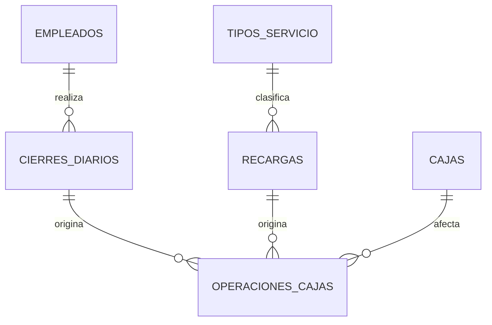
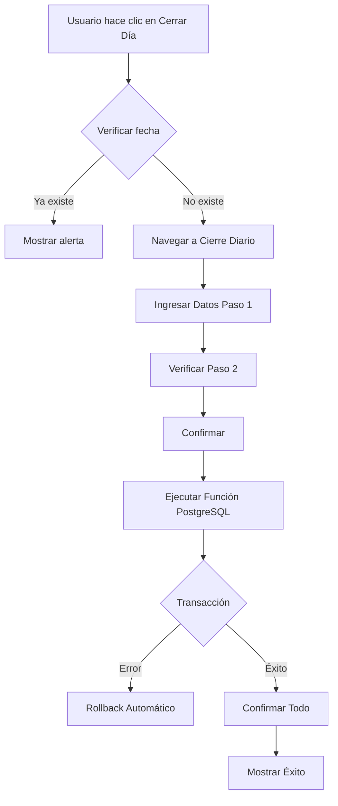

# Sistema de Control de Recargas y Cierre Diario

## Índice

1. [Introducción](#1-introducción)
2. [Arquitectura del Sistema](#2-arquitectura-del-sistema)
3. [Conceptos Clave](#3-conceptos-clave)
4. [Flujo Completo del Cierre Diario](#4-flujo-completo-del-cierre-diario)
5. [Sistema de Trazabilidad](#5-sistema-de-trazabilidad)
6. [Validaciones del Sistema](#6-validaciones-del-sistema)
7. [Ejemplo Práctico Completo](#7-ejemplo-práctico-completo)
8. [Queries de Auditoría](#8-queries-de-auditoría)
9. [Troubleshooting](#9-troubleshooting)

---

## 1. Introducción

Este documento describe el **Sistema de Control de Recargas y Cierre Diario** para Mi Tienda, un sistema completo de gestión de efectivo y saldos virtuales que maneja:

- ✅ Control de saldos virtuales (Bus y Celular)
- ✅ Gestión de 4 cajas de efectivo
- ✅ Cierre diario transaccional
- ✅ Trazabilidad 100% de operaciones
- ✅ Auditoría completa

### Características Principales

| Característica | Descripción |
|----------------|-------------|
| **Transaccional** | Rollback automático en caso de error |
| **Trazable** | Cada operación vinculada a su origen |
| **Validado** | Múltiples capas de validación |
| **Auditado** | Historial completo de operaciones |

---

## 2. Arquitectura del Sistema

### 2.1. Las 4 Cajas del Sistema

El sistema maneja 4 cajas independientes con propósitos específicos:

#### 🏦 CAJA (Principal)
- **Propósito**: Caja principal de la tienda
- **Recibe**: Efectivo de ventas diarias
- **Transfiere**: $20 diarios a CAJA_CHICA
- **Tipo**: Efectivo físico

#### 💰 CAJA_CHICA
- **Propósito**: Gastos menores y operativos
- **Recibe**: $20 diarios de CAJA (automático)
- **Recibe**: Comisiones de proveedores (manual)
- **Tipo**: Efectivo físico

#### 📱 CAJA_CELULAR
- **Propósito**: Control de efectivo de recargas celular
- **Recibe**: Efectivo de ventas de recargas celular
- **Tipo**: Efectivo físico

#### 🚌 CAJA_BUS
- **Propósito**: Control de efectivo de recargas bus
- **Recibe**: Efectivo de ventas de recargas bus
- **Tipo**: Efectivo físico

### 2.2. Tablas Principales



#### 📋 `cierres_diarios`
Registro maestro de cada cierre diario (uno por día).

| Campo | Descripción |
|-------|-------------|
| `id` | UUID único del cierre |
| `fecha` | Fecha del cierre (única) |
| `empleado_id` | Quién realizó el cierre |
| `efectivo_recaudado` | Efectivo total del día |
| `transferencia_caja_chica` | Monto transferido ($20) |
| `observaciones` | Notas del cierre |

#### 📊 `recargas`
Control diario de saldo virtual por servicio.

| Campo | Descripción |
|-------|-------------|
| `id` | UUID único |
| `fecha` | Fecha del registro |
| `tipo_servicio_id` | Bus o Celular |
| `venta_dia` | Venta del día |
| `saldo_virtual_anterior` | Saldo del día anterior |
| `saldo_virtual_actual` | Saldo resultante |
| `validado` | Validación matemática |

#### 🔍 `operaciones_cajas`
Auditoría completa de todas las operaciones.

| Campo | Descripción |
|-------|-------------|
| `id` | UUID único |
| `caja_id` | Caja afectada |
| `tipo_operacion` | INGRESO, EGRESO, etc. |
| `monto` | Monto de la operación |
| `saldo_anterior` | Saldo ANTES |
| `saldo_actual` | Saldo DESPUÉS |
| `tipo_referencia_id` | FK a tipos_referencia |
| `referencia_id` | UUID del origen |

#### 🏷️ `tipos_referencia`
Catálogo de tablas que originan operaciones.

| Código | Tabla | Descripción |
|--------|-------|-------------|
| `RECARGAS` | `recargas` | Operaciones de recargas |
| `CIERRES_DIARIOS` | `cierres_diarios` | Operaciones del cierre |

---

## 3. Conceptos Clave

### 3.1. Saldo Virtual

El **saldo virtual** representa el crédito disponible en las plataformas de recargas (Bus/Celular).

**Fórmula básica:**
```
Saldo Virtual Actual = Saldo Virtual Anterior - Venta del Día
```

**Ejemplo:**
```
Saldo anterior: $440.80
Venta del día:  $154.80
─────────────────────────
Saldo actual:   $286.00
```

### 3.2. Validación de Recargas

Cada registro se valida con:
```
Venta del Día + Saldo Virtual Actual = Saldo Virtual Anterior
```

**Ejemplo:**
```
$154.80 + $286.00 = $440.80 ✅
```

### 3.3. Tipos de Servicio

#### 🚌 Bus
- **Fondo Base**: $500
- **Comisión**: 1% mensual
- **Frecuencia Recarga**: Semanal

#### 📱 Celular
- **Fondo Base**: $200
- **Comisión**: 5% semanal
- **Frecuencia Recarga**: Semanal

---

## 4. Flujo Completo del Cierre Diario

### 4.1. Visión General



### 4.2. Paso a Paso Detallado

#### **Paso 1: Validación Inicial (Home)**

1. Usuario hace clic en "Cerrar Día"
2. Sistema obtiene fecha local (no UTC)
3. Verifica si existe cierre para esa fecha
4. Si existe → Muestra alerta y detiene
5. Si no existe → Navega a página de cierre

**Código:**
```typescript
const fechaLocal = this.recargasService.getFechaLocal();
const existeCierre = await this.recargasService.existeCierreDiario();
if (existeCierre) {
  // Bloquear navegación
}
```

#### **Paso 2: Captura de Datos**

Usuario ingresa en el formulario:
- Saldo Virtual Celular Final
- Saldo Virtual Bus Final
- Efectivo Total Recaudado
- Observaciones (opcional)

Sistema calcula automáticamente:
- Venta Celular = Saldo Anterior - Saldo Final
- Venta Bus = Saldo Anterior - Saldo Final

#### **Paso 3: Verificación**

Sistema muestra:
- Ventas calculadas
- Saldos finales de las 4 cajas
- Operaciones que se realizarán

Usuario revisa y confirma.

#### **Paso 4: Ejecución Transaccional**

Se llama a la función PostgreSQL `ejecutar_cierre_diario` que:

1. **Valida** que no exista cierre duplicado
2. **Obtiene** IDs necesarios (cajas, tipos, referencias)
3. **Calcula** ventas y saldos finales
4. **Crea** registro en `cierres_diarios` (captura UUID)
5. **Crea** 2 registros en `recargas` (captura UUIDs)
6. **Crea** 5 operaciones en `operaciones_cajas`:
   - CAJA: INGRESO (efectivo) → ref: cierre_diario
   - CAJA: TRANSFERENCIA_SALIENTE ($20) → ref: cierre_diario
   - CAJA_CHICA: TRANSFERENCIA_ENTRANTE ($20) → ref: cierre_diario
   - CAJA_CELULAR: INGRESO (venta) → ref: recarga_celular
   - CAJA_BUS: INGRESO (venta) → ref: recarga_bus
7. **Actualiza** saldos en las 4 cajas
8. **Retorna** resultado JSON

**Si cualquier paso falla → Rollback automático de TODO**

### 4.3. Diagrama de Operaciones

```
┌─────────────────────────────────────────────────────────────┐
│                    CIERRE DIARIO                            │
├─────────────────────────────────────────────────────────────┤
│                                                             │
│  1. cierres_diarios (UUID: abc-123)                        │
│     ├─ fecha: 2026-02-02                                   │
│     ├─ efectivo_recaudado: $500                            │
│     └─ transferencia: $20                                  │
│                                                             │
│  2. recargas                                               │
│     ├─ Celular (UUID: def-456)                            │
│     │  ├─ venta: $59.15                                    │
│     │  └─ saldo: $76.00                                    │
│     └─ Bus (UUID: ghi-789)                                │
│        ├─ venta: $154.80                                   │
│        └─ saldo: $286.00                                   │
│                                                             │
│  3. operaciones_cajas                                      │
│     ├─ CAJA: +$500 (ref: abc-123 → cierres_diarios)      │
│     ├─ CAJA: -$20  (ref: abc-123 → cierres_diarios)      │
│     ├─ CAJA_CHICA: +$20 (ref: abc-123 → cierres_diarios) │
│     ├─ CAJA_CELULAR: +$59.15 (ref: def-456 → recargas)   │
│     └─ CAJA_BUS: +$154.80 (ref: ghi-789 → recargas)      │
│                                                             │
│  4. cajas (actualización de saldos)                       │
│     ├─ CAJA: $480.00                                       │
│     ├─ CAJA_CHICA: $20.00                                  │
│     ├─ CAJA_CELULAR: $218.35                               │
│     └─ CAJA_BUS: $419.65                                   │
└─────────────────────────────────────────────────────────────┘
```

---

## 5. Sistema de Trazabilidad

### 5.1. ¿Qué es la Trazabilidad?

Capacidad de rastrear **el origen exacto** de cada movimiento de dinero en las cajas.

### 5.2. Implementación

Cada operación en `operaciones_cajas` tiene:
- `tipo_referencia_id`: Qué tabla la originó
- `referencia_id`: Qué registro específico

### 5.3. Mapeo de Referencias

| Operación | Tipo Referencia | Referencia ID | Tabla Origen |
|-----------|-----------------|---------------|--------------|
| Efectivo ventas | CIERRES_DIARIOS | UUID del cierre | `cierres_diarios` |
| Transferencia -$20 | CIERRES_DIARIOS | UUID del cierre | `cierres_diarios` |
| Transferencia +$20 | CIERRES_DIARIOS | UUID del cierre | `cierres_diarios` |
| Ingreso celular | RECARGAS | UUID recarga celular | `recargas` |
| Ingreso bus | RECARGAS | UUID recarga bus | `recargas` |

### 5.4. Ejemplo de Trazabilidad

**Pregunta:** ¿De dónde vienen los $59.15 en CAJA_CELULAR?

**Respuesta:**
```sql
SELECT
  o.monto,
  tr.tabla AS origen,
  r.venta_dia,
  ts.nombre AS tipo_servicio
FROM operaciones_cajas o
JOIN tipos_referencia tr ON o.tipo_referencia_id = tr.id
JOIN recargas r ON o.referencia_id = r.id
JOIN tipos_servicio ts ON r.tipo_servicio_id = ts.id
WHERE o.id = 'operacion-uuid';

-- Resultado:
-- monto: 59.15
-- origen: recargas
-- venta_dia: 59.15
-- tipo_servicio: Recargas Celular
```

**Conclusión:** Provienen de la venta de recargas celular del día.

---

## 6. Validaciones del Sistema

### 6.1. Validación de Fecha Local

**Problema:** `new Date().toISOString()` usa UTC, puede dar fecha +1.

**Solución:** Función `getFechaLocal()`
```typescript
getFechaLocal(): string {
  const now = new Date();
  const year = now.getFullYear();
  const month = String(now.getMonth() + 1).padStart(2, '0');
  const day = String(now.getDate()).padStart(2, '0');
  return `${year}-${month}-${day}`;
}
```

### 6.2. Validación de Duplicados

**Triple protección:**

1. **Home** - Verifica antes de navegar
2. **Función PostgreSQL** - Valida al guardar
3. **Constraint UNIQUE** - Última defensa en BD

### 6.3. Validación de Consistencia

**En recargas:**
```sql
validado = (venta_dia + saldo_virtual_actual = saldo_virtual_anterior)
```

**En operaciones:**
```sql
saldo_actual = saldo_anterior ± monto
```

---

## 7. Ejemplo Práctico Completo

### Contexto Inicial

**Fecha:** 2026-02-02
**Empleado:** Ivan Sanchez

**Saldos Anteriores (antes del cierre):**
- Saldo Virtual Celular: $135.15
- Saldo Virtual Bus: $440.80
- CAJA: $0.00
- CAJA_CHICA: $0.00
- CAJA_CELULAR: $159.20
- CAJA_BUS: $264.85

### Paso 1: Usuario Ingresa Datos

Usuario registra:
- Saldo Virtual Celular Final: **$76.00**
- Saldo Virtual Bus Final: **$286.00**
- Efectivo Total Recaudado: **$500.00**

### Paso 2: Sistema Calcula

**Ventas:**
```
Venta Celular = $135.15 - $76.00 = $59.15
Venta Bus = $440.80 - $286.00 = $154.80
```

**Saldos Finales Cajas:**
```
CAJA = $0.00 + $500.00 - $20.00 = $480.00
CAJA_CHICA = $0.00 + $20.00 = $20.00
CAJA_CELULAR = $159.20 + $59.15 = $218.35
CAJA_BUS = $264.85 + $154.80 = $419.65
```

### Paso 3: Sistema Ejecuta

#### 3.1. Crea Cierre Diario
```sql
INSERT INTO cierres_diarios VALUES (
  'uuid-cierre-123',
  '2026-02-02',
  1, -- empleado_id
  500.00,
  20.00,
  NULL
) RETURNING id;
-- Retorna: uuid-cierre-123
```

#### 3.2. Crea Recargas
```sql
INSERT INTO recargas VALUES
('uuid-rec-celular-456', '2026-02-02', 1, 1, 59.15, 135.15, 76.00, TRUE, NULL),
('uuid-rec-bus-789', '2026-02-02', 2, 1, 154.80, 440.80, 286.00, TRUE, NULL);
```

#### 3.3. Crea Operaciones
```sql
-- 1. CAJA: INGRESO
INSERT INTO operaciones_cajas VALUES (
  'uuid-op-1', NOW(), 1, 1, 'INGRESO', 500.00,
  0.00, 500.00,
  2, 'uuid-cierre-123', -- ref: cierres_diarios
  'Efectivo de ventas de tienda'
);

-- 2. CAJA: TRANSFERENCIA_SALIENTE
INSERT INTO operaciones_cajas VALUES (
  'uuid-op-2', NOW(), 1, 1, 'TRANSFERENCIA_SALIENTE', 20.00,
  500.00, 480.00,
  2, 'uuid-cierre-123', -- ref: cierres_diarios
  'Transferencia diaria a caja chica'
);

-- 3. CAJA_CHICA: TRANSFERENCIA_ENTRANTE
INSERT INTO operaciones_cajas VALUES (
  'uuid-op-3', NOW(), 2, 1, 'TRANSFERENCIA_ENTRANTE', 20.00,
  0.00, 20.00,
  2, 'uuid-cierre-123', -- ref: cierres_diarios
  'Transferencia desde caja principal'
);

-- 4. CAJA_CELULAR: INGRESO
INSERT INTO operaciones_cajas VALUES (
  'uuid-op-4', NOW(), 3, 1, 'INGRESO', 59.15,
  159.20, 218.35,
  1, 'uuid-rec-celular-456', -- ref: recargas
  'Venta de recargas celular'
);

-- 5. CAJA_BUS: INGRESO
INSERT INTO operaciones_cajas VALUES (
  'uuid-op-5', NOW(), 4, 1, 'INGRESO', 154.80,
  264.85, 419.65,
  1, 'uuid-rec-bus-789', -- ref: recargas
  'Venta de recargas bus'
);
```

#### 3.4. Actualiza Saldos
```sql
UPDATE cajas SET saldo_actual = 480.00 WHERE id = 1;    -- CAJA
UPDATE cajas SET saldo_actual = 20.00 WHERE id = 2;     -- CAJA_CHICA
UPDATE cajas SET saldo_actual = 218.35 WHERE id = 3;    -- CAJA_CELULAR
UPDATE cajas SET saldo_actual = 419.65 WHERE id = 4;    -- CAJA_BUS
```

### Resultado Final

**Estado del Sistema:**

| Tabla | Registros Nuevos |
|-------|------------------|
| `cierres_diarios` | 1 |
| `recargas` | 2 (Celular + Bus) |
| `operaciones_cajas` | 5 |
| `cajas` | 4 (actualizados) |

**Saldos Finales:**
- ✅ CAJA: $480.00
- ✅ CAJA_CHICA: $20.00
- ✅ CAJA_CELULAR: $218.35
- ✅ CAJA_BUS: $419.65

**Trazabilidad:** 100% ✅

---

## 8. Queries de Auditoría

### 8.1. Ver Cierre del Día

```sql
SELECT
  cd.fecha,
  e.nombre AS empleado,
  cd.efectivo_recaudado,
  cd.transferencia_caja_chica,
  cd.observaciones
FROM cierres_diarios cd
JOIN empleados e ON cd.empleado_id = e.id
WHERE cd.fecha = '2026-02-02';
```

### 8.2. Ver Recargas del Día

```sql
SELECT
  r.fecha,
  ts.nombre AS servicio,
  r.saldo_virtual_anterior,
  r.venta_dia,
  r.saldo_virtual_actual,
  r.validado
FROM recargas r
JOIN tipos_servicio ts ON r.tipo_servicio_id = ts.id
WHERE r.fecha = '2026-02-02'
ORDER BY ts.nombre;
```

### 8.3. Ver Operaciones con Trazabilidad

```sql
SELECT
  o.fecha,
  c.nombre AS caja,
  o.tipo_operacion,
  o.monto,
  o.saldo_anterior,
  o.saldo_actual,
  tr.tabla AS origen_tabla,
  o.descripcion
FROM operaciones_cajas o
JOIN cajas c ON o.caja_id = c.id
LEFT JOIN tipos_referencia tr ON o.tipo_referencia_id = tr.id
WHERE DATE(o.fecha) = '2026-02-02'
ORDER BY o.fecha;
```

### 8.4. Ver Detalle de una Operación

```sql
SELECT
  o.descripcion AS operacion,
  o.monto,
  tr.tabla AS origen,
  CASE
    WHEN tr.tabla = 'recargas' THEN
      (SELECT ts.nombre FROM recargas r
       JOIN tipos_servicio ts ON r.tipo_servicio_id = ts.id
       WHERE r.id = o.referencia_id)
    WHEN tr.tabla = 'cierres_diarios' THEN
      'Cierre Diario'
  END AS detalle_origen
FROM operaciones_cajas o
LEFT JOIN tipos_referencia tr ON o.tipo_referencia_id = tr.id
WHERE o.id = 'uuid-operacion';
```

### 8.5. Auditoría Completa del Mes

```sql
SELECT
  DATE(o.fecha) AS fecha,
  c.nombre AS caja,
  SUM(CASE WHEN o.tipo_operacion IN ('INGRESO', 'TRANSFERENCIA_ENTRANTE')
           THEN o.monto ELSE 0 END) AS ingresos,
  SUM(CASE WHEN o.tipo_operacion IN ('EGRESO', 'TRANSFERENCIA_SALIENTE')
           THEN o.monto ELSE 0 END) AS egresos
FROM operaciones_cajas o
JOIN cajas c ON o.caja_id = c.id
WHERE DATE(o.fecha) >= '2026-02-01'
  AND DATE(o.fecha) <= '2026-02-29'
GROUP BY DATE(o.fecha), c.nombre
ORDER BY fecha DESC, c.nombre;
```

---

## 9. Troubleshooting

### 9.1. Error: "Ya existe un cierre para hoy"

**Causa:** Intentando hacer cierre duplicado.

**Solución:**
1. Verificar en Supabase:
   ```sql
   SELECT * FROM recargas WHERE fecha = CURRENT_DATE;
   ```
2. Si necesitas rehacerlo, eliminar:
   ```sql
   DELETE FROM operaciones_cajas WHERE DATE(fecha) = CURRENT_DATE;
   DELETE FROM recargas WHERE fecha = CURRENT_DATE;
   DELETE FROM cierres_diarios WHERE fecha = CURRENT_DATE;
   ```

### 9.2. Fecha Incorrecta en Android

**Causa:** Problema de zona horaria (UTC vs local).

**Solución:** Ya implementada con `getFechaLocal()`. Hacer:
```bash
npx cap sync android
```

### 9.3. Operación sin Trazabilidad

**Causa:** `tipo_referencia_id` o `referencia_id` es NULL.

**Investigar:**
```sql
SELECT * FROM operaciones_cajas
WHERE tipo_referencia_id IS NULL
  OR referencia_id IS NULL;
```

**Solución:** Verificar que la función PostgreSQL esté actualizada (versión 3.0).

### 9.4. Saldos Descuadrados

**Verificar consistencia:**
```sql
-- Verificar que saldo en cajas coincida con última operación
SELECT
  c.nombre,
  c.saldo_actual AS saldo_caja,
  o.saldo_actual AS saldo_ultima_operacion
FROM cajas c
LEFT JOIN LATERAL (
  SELECT saldo_actual
  FROM operaciones_cajas
  WHERE caja_id = c.id
  ORDER BY fecha DESC
  LIMIT 1
) o ON TRUE
WHERE c.saldo_actual != o.saldo_actual OR o.saldo_actual IS NULL;
```

---

## Resumen

### Flujo en 5 Pasos

1. ✅ **Validar** - Verificar que no existe cierre
2. ✅ **Capturar** - Ingresar datos del día
3. ✅ **Verificar** - Revisar cálculos
4. ✅ **Ejecutar** - Función transaccional PostgreSQL
5. ✅ **Confirmar** - Todo guardado con trazabilidad

### Garantías del Sistema

- 🔒 **Transaccional**: Rollback automático
- 🔍 **Trazable**: Origen de cada operación
- ✅ **Validado**: Múltiples capas de validación
- 📊 **Auditable**: Historial completo

### Archivos Relacionados

**Documentacion de Base de Datos:**
- 🗄️ [Schema de Base de Datos](../../../../doc/schema_inicial_completo.sql) - Estructura completa de tablas
- ⚙️ [Funcion PostgreSQL](./funcion_cierre_diario.md) - Funcion transaccional `ejecutar_cierre_diario()`

**Documentacion Tecnica:**
- 💻 [Dashboard README](./DASHBOARD-README.md) - Documentacion tecnica de componentes y patrones
- 🔧 [Recargas Service](../services/recargas.service.ts) - Servicio principal

---

**Fecha de Actualizacion:** 2026-02-02
**Version:** 3.0 (Sistema Completo con Trazabilidad)
**Autor:** Sistema Mi Tienda
