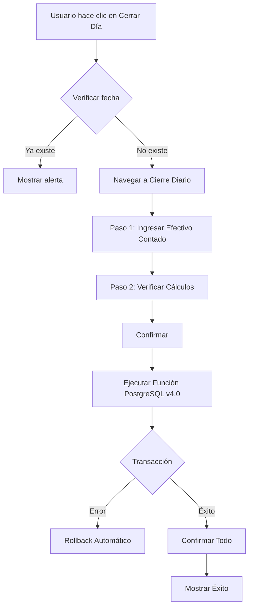

# Sistema de Control de Recargas y Cierre Diario (VERSIÓN 4.0)

**IMPORTANTE:** Este documento refleja la Versión 4.0 del sistema donde:
- ✅ Ultra-simplificado: Solo 1 campo de entrada (efectivo_recaudado)
- ✅ Configuración centralizada: fondo_fijo desde configuraciones
- ✅ Fórmula simplificada: depósito = efectivo - fondo - transferencia
- ✅ `caja_fisica_diaria` representa la **CAJA FÍSICA del día**
- ✅ `CAJA` (tabla cajas) es la **caja de ACUMULACIÓN**

## Índice

1. [Introducción](#1-introducción)
2. [Cambios Versión 4.0](#2-cambios-versión-40)
3. [Arquitectura del Sistema](#3-arquitectura-del-sistema)
4. [Conceptos Clave](#4-conceptos-clave)
5. [Flujo Completo del Cierre Diario](#5-flujo-completo-del-cierre-diario)
6. [Sistema de Trazabilidad](#6-sistema-de-trazabilidad)
7. [Validaciones del Sistema](#7-validaciones-del-sistema)
8. [Ejemplo Práctico Completo](#8-ejemplo-práctico-completo)
9. [Queries de Auditoría](#9-queries-de-auditoría)
10. [Troubleshooting](#10-troubleshooting)

---

## 1. Introducción

Este documento describe el **Sistema de Control de Recargas y Cierre Diario v4.0** para Mi Tienda, un sistema ultra-simplificado de gestión de efectivo y saldos virtuales que maneja:

- ✅ Control de saldos virtuales (Bus y Celular)
- ✅ Gestión de 4 cajas de efectivo
- ✅ Cierre diario transaccional
- ✅ Trazabilidad 100% de operaciones
- ✅ Auditoría completa
- ✅ **NUEVO:** Configuración centralizada del fondo fijo
- ✅ **NUEVO:** Solo 1 campo de entrada requerido

### Características Principales

| Característica | Descripción |
|----------------|-------------|
| **Ultra-Simplificado** | Solo requiere 1 campo: efectivo_recaudado |
| **Configuración Centralizada** | Fondo fijo y transferencia desde config |
| **Transaccional** | Rollback automático en caso de error |
| **Trazable** | Cada operación vinculada a su origen |
| **Validado** | Múltiples capas de validación |
| **Auditado** | Historial completo de operaciones |

---

## 2. Cambios Versión 4.0

### 2.1. Simplificación Radical

#### Antes (v2.0 y v3.0)
Usuario debía ingresar:
- Saldo inicial (fondo de apertura)
- Efectivo recaudado
- Egresos del día
- Fondo siguiente día (cierre)

**4 campos variables + cálculos manuales**

#### Ahora (v4.0)
Usuario solo ingresa:
- **Efectivo Total Contado** (al final del día)

**1 SOLO CAMPO** 🎉

### 2.2. Configuración Centralizada

El fondo fijo ($40) ahora se define en la tabla `configuraciones`:

```sql
-- Tabla configuraciones
fondo_fijo_diario: 40.00  -- Antes era variable en cada cierre
caja_chica_transferencia_diaria: 20.00
```

### 2.3. Campos Eliminados

De la tabla `caja_fisica_diaria`:
- ❌ `saldo_inicial` (ya no es variable)
- ❌ `egresos_del_dia` (se simplificó el flujo)
- ❌ `fondo_siguiente_dia` (viene de config)
- ❌ `transferencia_caja_chica` (viene de config)

### 2.4. Fórmula Simplificada

```
dinero_a_depositar = efectivo_recaudado - fondo_fijo - transferencia_caja_chica
```

**Ejemplo:**
```
Efectivo contado: $140.00
Fondo fijo:       $ 40.00 (de config)
Transferencia:    $ 20.00 (de config)
─────────────────────────
Depósito a CAJA:  $ 80.00
```

### 2.5. Operaciones Simplificadas

Solo 2 operaciones principales:
1. **INGRESO** a CAJA PRINCIPAL (el depósito calculado)
2. **TRANSFERENCIA_ENTRANTE** a CAJA_CHICA ($20)

Las operaciones de recargas (celular y bus) se mantienen igual.

---

## 3. Arquitectura del Sistema

### 3.1. Las 4 Cajas del Sistema

El sistema maneja 4 cajas independientes con propósitos específicos:

#### 🏦 CAJA (Principal) - **VERSIÓN 4.0**
- **Propósito**: **Caja de ACUMULACIÓN** (como caja fuerte)
- **Recibe**: Depósitos del efectivo recaudado cada día (calculado automáticamente)
- **Nota**: NO recibe los $20 de transferencia (se toman físicamente del efectivo)
- **Tipo**: Efectivo acumulado (NO es la caja física del día)

#### 💰 CAJA_CHICA
- **Propósito**: Gastos menores y operativos
- **Recibe**: $20 diarios (automático desde config)
- **Tipo**: Efectivo físico

#### 📱 CAJA_CELULAR
- **Propósito**: Control de efectivo de recargas celular
- **Recibe**: Efectivo de ventas de recargas celular
- **Tipo**: Efectivo físico

#### 🚌 CAJA_BUS
- **Propósito**: Control de efectivo de recargas bus
- **Recibe**: Efectivo de ventas de recargas bus
- **Tipo**: Efectivo físico

### 3.2. Tablas Principales

#### 📋 `caja_fisica_diaria` - **VERSIÓN 4.0**
Representa la **CAJA FÍSICA del día** (ultra-simplificada).

| Campo | Descripción |
|-------|-------------|
| `id` | UUID único del cierre |
| `fecha` | Fecha del cierre (única) |
| `empleado_id` | Quién realizó el cierre |
| **`efectivo_recaudado`** ⭐ | **¡ÚNICO CAMPO REQUERIDO!** |
| `observaciones` | Notas del cierre (opcional) |

⭐ = Solo este campo necesita ingresarse

#### ⚙️ `configuraciones` - **NUEVA EN V4.0**
Configuración centralizada del sistema.

| Campo | Valor Default | Descripción |
|-------|---------------|-------------|
| `fondo_fijo_diario` | 40.00 | Fondo que se deja para el día siguiente |
| `caja_chica_transferencia_diaria` | 20.00 | Transferencia fija a caja chica |

#### 📊 `recargas`
Control diario de saldo virtual por servicio (sin cambios).

#### 🔍 `operaciones_cajas`
Auditoría completa de todas las operaciones (sin cambios).

---

## 4. Conceptos Clave

### 4.1. Distribución Física del Efectivo (v4.0)

Cuando el usuario cuenta **$140** en efectivo al final del día:

```
┌────────────────────────────────────────────────┐
│  Del efectivo contado ($140):                  │
│  📦 $80.00  → Funda CAJA PRINCIPAL             │
│  💼 $20.00  → Funda CAJA CHICA                 │
│  💵 $40.00  → Dejar en caja física (mañana)    │
└────────────────────────────────────────────────┘
```

### 4.2. Cálculo Automático

El sistema calcula automáticamente:

```typescript
// Desde configuración (BD)
const fondo_fijo = 40.00;
const transferencia = 20.00;

// Ingresado por usuario
const efectivo_recaudado = 140.00;

// Calculado automáticamente
const dinero_a_depositar = efectivo_recaudado - fondo_fijo - transferencia;
// = 140 - 40 - 20 = 80
```

### 4.3. Operaciones Creadas

```
1. CAJA (Principal)
   ├─ INGRESO: +$80.00 (depósito calculado)
   └─ Origen: caja_fisica_diaria

2. CAJA_CHICA
   ├─ TRANSFERENCIA_ENTRANTE: +$20.00
   └─ Origen: caja_fisica_diaria

3. CAJA_CELULAR
   ├─ INGRESO: +[venta_celular]
   └─ Origen: recargas

4. CAJA_BUS
   ├─ INGRESO: +[venta_bus]
   └─ Origen: recargas
```

---

## 5. Flujo Completo del Cierre Diario

### 5.1. Visión General



### 5.2. Paso a Paso Detallado

#### **Paso 1: Ingresar Datos (Ultra-Simplificado)**

Usuario solo ingresa:
- ✅ **Efectivo Total Contado**: El dinero en caja física al final del día
- ✅ Saldo Virtual Celular Final
- ✅ Saldo Virtual Bus Final
- ⚪ Observaciones (opcional)

#### **Paso 2: Verificación**

Sistema muestra:

**📊 Resumen del Día**
- Efectivo Total Contado
- Fondo Siguiente Día (desde config)
- Dinero a Depositar (calculado)
- Venta Celular
- Venta Bus

**👉 ¿Qué hacer con el dinero?**
- $X → Funda CAJA PRINCIPAL
- $20 → Funda CAJA CHICA
- $40 → Dejar en caja (mañana)

**🔍 Verificación de Cajas**
- CAJA (Acumulación): anterior + depósito = final
- CAJA_CHICA: anterior + $20 = final
- CAJA_CELULAR: anterior + venta = final
- CAJA_BUS: anterior + venta = final

#### **Paso 3: Ejecución Transaccional (v4.0)**

Se llama a la función PostgreSQL `ejecutar_cierre_diario` que:

1. **Obtiene configuración** del sistema
   ```sql
   SELECT fondo_fijo_diario, caja_chica_transferencia_diaria
   FROM configuraciones;
   ```

2. **Calcula** depósito automáticamente
   ```sql
   dinero_a_depositar := efectivo_recaudado - fondo_fijo - transferencia;
   ```

3. **Valida** que depósito no sea negativo

4. **Crea** registro en `caja_fisica_diaria` (solo efectivo_recaudado)

5. **Crea** 2 registros en `recargas` (Celular + Bus)

6. **Crea** 4 operaciones en `operaciones_cajas`:
   - CAJA: INGRESO (depósito) → ref: cierre_diario
   - CAJA_CHICA: TRANSFERENCIA_ENTRANTE ($20) → ref: cierre_diario
   - CAJA_CELULAR: INGRESO (venta) → ref: recarga_celular
   - CAJA_BUS: INGRESO (venta) → ref: recarga_bus

7. **Actualiza** saldos en las 4 cajas

8. **Retorna** resultado JSON

**Si cualquier paso falla → Rollback automático de TODO**

### 5.3. Diagrama de Operaciones (VERSIÓN 4.0)

```
┌──────────────────────────────────────────────────────────────────┐
│                    CIERRE DIARIO v4.0                            │
│                  (ULTRA-SIMPLIFICADO)                            │
├──────────────────────────────────────────────────────────────────┤
│                                                                  │
│  1. caja_fisica_diaria (UUID: abc-123)                          │
│     ├─ fecha: 2026-02-05                                        │
│     ├─ efectivo_recaudado: $140 ⭐ (¡ÚNICO CAMPO!)             │
│     └─ observaciones: null                                      │
│                                                                  │
│  2. configuraciones (tabla del sistema)                         │
│     ├─ fondo_fijo_diario: $40                                   │
│     └─ caja_chica_transferencia_diaria: $20                     │
│                                                                  │
│  3. cálculo automático                                          │
│     └─ dinero_a_depositar: $140 - $40 - $20 = $80              │
│                                                                  │
│  4. recargas                                                    │
│     ├─ Celular (UUID: def-456): venta $25, saldo $75          │
│     └─ Bus (UUID: ghi-789): venta $35, saldo $250             │
│                                                                  │
│  5. operaciones_cajas                                           │
│     ├─ CAJA: +$80 INGRESO (ref: abc-123)                       │
│     ├─ CAJA_CHICA: +$20 TRANSFERENCIA_ENTRANTE (ref: abc-123) │
│     ├─ CAJA_CELULAR: +$25 (ref: def-456)                       │
│     └─ CAJA_BUS: +$35 (ref: ghi-789)                           │
│                                                                  │
│  6. cajas (saldos finales)                                     │
│     ├─ CAJA (acumulación): anterior + $80                      │
│     ├─ CAJA_CHICA: anterior + $20                              │
│     ├─ CAJA_CELULAR: anterior + $25                            │
│     └─ CAJA_BUS: anterior + $35                                │
│                                                                  │
│  Caja física (implícita): $40 queda para mañana               │
└──────────────────────────────────────────────────────────────────┘

⭐ = ÚNICO campo que ingresa el usuario
```

---

## 6. Sistema de Trazabilidad

### 6.1. Mapeo de Referencias (v4.0)

| Operación | Tipo Referencia | Referencia ID | Tabla Origen |
|-----------|-----------------|---------------|--------------|
| Depósito a CAJA | CAJA_FISICA_DIARIA | UUID del cierre | `caja_fisica_diaria` |
| Transferencia CAJA_CHICA | CAJA_FISICA_DIARIA | UUID del cierre | `caja_fisica_diaria` |
| Ingreso celular | RECARGAS | UUID recarga celular | `recargas` |
| Ingreso bus | RECARGAS | UUID recarga bus | `recargas` |

### 6.2. Ejemplo de Trazabilidad

**Pregunta:** ¿De dónde vienen los $80 en CAJA?

**Respuesta:**
```sql
SELECT
  o.monto,
  tr.tabla AS origen,
  cf.efectivo_recaudado,
  cf.fecha
FROM operaciones_cajas o
JOIN tipos_referencia tr ON o.tipo_referencia_id = tr.id
JOIN caja_fisica_diaria cf ON o.referencia_id = cf.id
WHERE o.id = 'operacion-uuid';

-- Resultado:
-- monto: 80.00
-- origen: caja_fisica_diaria
-- efectivo_recaudado: 140.00
-- fecha: 2026-02-05
```

**Conclusión:** Provienen del depósito calculado del cierre diario (efectivo_recaudado - fondo - transferencia).

---

## 7. Validaciones del Sistema

### 7.1. Validación de Depósito No Negativo

**Nueva en v4.0:**

```sql
IF dinero_a_depositar < 0 THEN
  RAISE EXCEPTION 'El dinero a depositar no puede ser negativo.
    Efectivo: $%, Fondo: $%, Transferencia: $%',
    efectivo_recaudado, fondo_fijo, transferencia;
END IF;
```

**Ejemplo de error:**
```
Efectivo contado: $30
Fondo:           $40
Transferencia:   $20
─────────────────────
Depósito:        -$30 ❌

Error: "El dinero a depositar no puede ser negativo"
```

### 7.2. Validación de Configuración

```sql
-- Validar que exista configuración
IF fondo_fijo IS NULL OR transferencia_diaria IS NULL THEN
  RAISE EXCEPTION 'No se encontró configuración del sistema';
END IF;
```

### 7.3. Otras Validaciones (sin cambios)

- Fecha local (no UTC)
- Duplicados (triple protección)
- Consistencia de recargas
- Consistencia de operaciones

---

## 8. Ejemplo Práctico Completo

### Contexto Inicial

**Fecha:** 2026-02-05
**Empleado:** Ivan Sanchez

**Configuración del Sistema:**
- Fondo Fijo Diario: $40.00
- Transferencia Caja Chica: $20.00

**Saldos Anteriores (antes del cierre):**
- Saldo Virtual Celular: $100.00
- Saldo Virtual Bus: $285.00
- CAJA: $500.00
- CAJA_CHICA: $30.00
- CAJA_CELULAR: $200.00
- CAJA_BUS: $400.00

### Paso 1: Usuario Ingresa Datos (¡Solo 1 campo!)

Usuario registra:
- **Efectivo Total Contado: $140.00** ⭐
- Saldo Virtual Celular Final: $75.00
- Saldo Virtual Bus Final: $250.00

### Paso 2: Sistema Calcula Automáticamente

**Configuración (desde BD):**
```
Fondo Fijo = $40.00
Transferencia = $20.00
```

**Cálculo del Depósito:**
```
Dinero a Depositar = $140.00 - $40.00 - $20.00 = $80.00
```

**Ventas de Recargas:**
```
Venta Celular = $100.00 - $75.00 = $25.00
Venta Bus = $285.00 - $250.00 = $35.00
```

**Saldos Finales Cajas:**
```
CAJA = $500.00 + $80.00 = $580.00
CAJA_CHICA = $30.00 + $20.00 = $50.00
CAJA_CELULAR = $200.00 + $25.00 = $225.00
CAJA_BUS = $400.00 + $35.00 = $435.00
```

### Paso 3: Sistema Ejecuta (Transacción Atómica)

#### 3.1. Crea Cierre Diario
```sql
INSERT INTO caja_fisica_diaria VALUES (
  'uuid-cierre-123',
  '2026-02-05',
  1, -- empleado_id
  140.00, -- efectivo_recaudado (¡ÚNICO CAMPO!)
  NULL -- observaciones
) RETURNING id;
```

#### 3.2. Crea Recargas
```sql
INSERT INTO recargas VALUES
('uuid-rec-celular-456', '2026-02-05', 1, 1, 25.00, 100.00, 75.00, TRUE),
('uuid-rec-bus-789', '2026-02-05', 1, 2, 35.00, 285.00, 250.00, TRUE);
```

#### 3.3. Crea Operaciones (v4.0 - Simplificadas)
```sql
-- 1. CAJA: INGRESO (depósito calculado)
INSERT INTO operaciones_cajas VALUES (
  'uuid-op-1', NOW(), 1, 1, 'INGRESO', 80.00,
  500.00, 580.00,
  (SELECT id FROM tipos_referencia WHERE codigo = 'CAJA_FISICA_DIARIA'),
  'uuid-cierre-123',
  'Depósito del día 2026-02-05'
);

-- 2. CAJA_CHICA: TRANSFERENCIA_ENTRANTE
INSERT INTO operaciones_cajas VALUES (
  'uuid-op-2', NOW(), 2, 1, 'TRANSFERENCIA_ENTRANTE', 20.00,
  30.00, 50.00,
  (SELECT id FROM tipos_referencia WHERE codigo = 'CAJA_FISICA_DIARIA'),
  'uuid-cierre-123',
  'Transferencia diaria desde caja física'
);

-- 3. CAJA_CELULAR: INGRESO
INSERT INTO operaciones_cajas VALUES (
  'uuid-op-3', NOW(), 3, 1, 'INGRESO', 25.00,
  200.00, 225.00,
  (SELECT id FROM tipos_referencia WHERE codigo = 'RECARGAS'),
  'uuid-rec-celular-456',
  'Venta del día 2026-02-05'
);

-- 4. CAJA_BUS: INGRESO
INSERT INTO operaciones_cajas VALUES (
  'uuid-op-4', NOW(), 4, 1, 'INGRESO', 35.00,
  400.00, 435.00,
  (SELECT id FROM tipos_referencia WHERE codigo = 'RECARGAS'),
  'uuid-rec-bus-789',
  'Venta del día 2026-02-05'
);
```

#### 3.4. Actualiza Saldos
```sql
UPDATE cajas SET saldo_actual = 580.00 WHERE id = 1;  -- CAJA
UPDATE cajas SET saldo_actual = 50.00 WHERE id = 2;   -- CAJA_CHICA
UPDATE cajas SET saldo_actual = 225.00 WHERE id = 3;  -- CAJA_CELULAR
UPDATE cajas SET saldo_actual = 435.00 WHERE id = 4;  -- CAJA_BUS
```

### Resultado Final

**Estado del Sistema:**

| Tabla | Registros Nuevos |
|-------|------------------|
| `caja_fisica_diaria` | 1 |
| `recargas` | 2 (Celular + Bus) |
| `operaciones_cajas` | 4 |
| `cajas` | 4 (actualizados) |

**Saldos Finales:**
- ✅ CAJA: $580.00
- ✅ CAJA_CHICA: $50.00
- ✅ CAJA_CELULAR: $225.00
- ✅ CAJA_BUS: $435.00

**Caja Física (implícito):** $40.00 queda para mañana

**Trazabilidad:** 100% ✅

---

## 9. Queries de Auditoría

### 9.1. Ver Cierre del Día (v4.0)

```sql
SELECT
  cf.fecha,
  e.nombre AS empleado,
  cf.efectivo_recaudado,
  c.fondo_fijo_diario,
  c.caja_chica_transferencia_diaria,
  (cf.efectivo_recaudado - c.fondo_fijo_diario - c.caja_chica_transferencia_diaria) AS dinero_depositado,
  cf.observaciones
FROM caja_fisica_diaria cf
JOIN empleados e ON cf.empleado_id = e.id
CROSS JOIN configuraciones c
WHERE cf.fecha = '2026-02-05';
```

### 9.2. Ver Operaciones del Cierre

```sql
SELECT
  o.fecha,
  c.nombre AS caja,
  o.tipo_operacion,
  o.monto,
  o.saldo_anterior,
  o.saldo_actual,
  o.descripcion
FROM operaciones_cajas o
JOIN cajas c ON o.caja_id = c.id
JOIN tipos_referencia tr ON o.tipo_referencia_id = tr.id
JOIN caja_fisica_diaria cf ON o.referencia_id = cf.id
WHERE cf.fecha = '2026-02-05'
  AND tr.codigo = 'CAJA_FISICA_DIARIA'
ORDER BY o.fecha;
```

### 9.3. Auditoría de Configuración

```sql
-- Ver configuración actual
SELECT
  fondo_fijo_diario,
  caja_chica_transferencia_diaria,
  updated_at
FROM configuraciones
ORDER BY updated_at DESC
LIMIT 1;
```

---

## 10. Troubleshooting

### 10.1. Error: "El dinero a depositar no puede ser negativo"

**Causa:** El efectivo contado es menor que (fondo_fijo + transferencia).

**Ejemplo:**
```
Efectivo contado: $50
Fondo fijo: $40
Transferencia: $20
Total necesario: $60
Falta: $10 ❌
```

**Solución:**
1. Revisar la configuración del sistema
2. Verificar que el efectivo contado sea correcto
3. Ajustar valores de configuración si es necesario

### 10.2. Error: "No se encontró configuración del sistema"

**Causa:** Falta registro en tabla `configuraciones`.

**Solución:**
```sql
INSERT INTO configuraciones (
  fondo_fijo_diario,
  caja_chica_transferencia_diaria
) VALUES (40.00, 20.00);
```

### 10.3. Necesito cambiar el fondo fijo

**Solución:**
```sql
UPDATE configuraciones
SET fondo_fijo_diario = 50.00,
    updated_at = NOW()
WHERE id = 1;
```

**IMPORTANTE:** Esto afectará todos los cierres futuros.

---

## Resumen

### Flujo en 3 Pasos (v4.0)

1. ✅ **Ingresar** - Solo 1 campo: efectivo contado
2. ✅ **Verificar** - Sistema calcula todo automáticamente
3. ✅ **Confirmar** - Función transaccional PostgreSQL

### Ventajas Versión 4.0

- ✨ **Ultra-simple**: Solo 1 campo de entrada
- ⚡ **Rápido**: Menos datos = cierre más rápido
- 🎯 **Sin errores**: Sistema calcula automáticamente
- 🔧 **Configurable**: Fondo fijo desde config
- 📊 **Trazable**: Igual que v2.0 y v3.0

### Garantías del Sistema

- 🔒 **Transaccional**: Rollback automático
- 🔍 **Trazable**: Origen de cada operación
- ✅ **Validado**: Múltiples capas de validación
- 📊 **Auditable**: Historial completo
- ⚙️ **Configuración centralizada**: Cambios globales desde config

### Archivos Relacionados

**Base de Datos:**
- 🗄️ [Schema de Base de Datos v4.0](../../../../doc/schema_inicial_completo.sql)
- ⚙️ [Función PostgreSQL v4.0](../../../../doc/funcion_cierre_diario_v4.sql)

**Código Frontend:**
- 💻 [Cierre Diario Page (TS)](../pages/cierre-diario/cierre-diario.page.ts)
- 🎨 [Cierre Diario Page (HTML)](../pages/cierre-diario/cierre-diario.page.html)
- 🔧 [Recargas Service](../services/recargas.service.ts)

**Documentación:**
- 📖 [Dashboard README](./DASHBOARD-README.md)

---

## 📝 HISTORIAL DE VERSIONES

### Versión 4.0 (2026-02-05)
- ✅ Ultra-simplificado: Solo 1 campo de entrada
- ✅ Configuración centralizada (fondo_fijo_diario)
- ✅ Fórmula simplificada: depósito = efectivo - fondo - transferencia
- ✅ Eliminados campos: saldo_inicial, egresos_del_dia, fondo_siguiente_dia, transferencia_caja_chica
- ✅ UI mejorada con guía visual "¿Qué hacer con el dinero?"

### Versión 3.0
- ✅ Renombrado cierres_diarios → caja_fisica_diaria
- ✅ Ajustes en función PostgreSQL

### Versión 2.0
- ✅ Separación caja física vs acumulación
- ✅ Nuevos campos: saldo_inicial, egresos_del_dia, fondo_siguiente_dia

### Versión 1.0
- ✅ Implementación inicial

---

**Fecha de Actualización:** 2026-02-05
**Versión:** 4.0 (Ultra-Simplificado)
**Autor:** Sistema Mi Tienda
